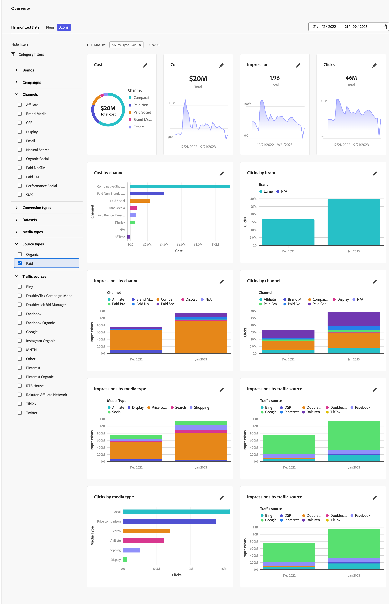
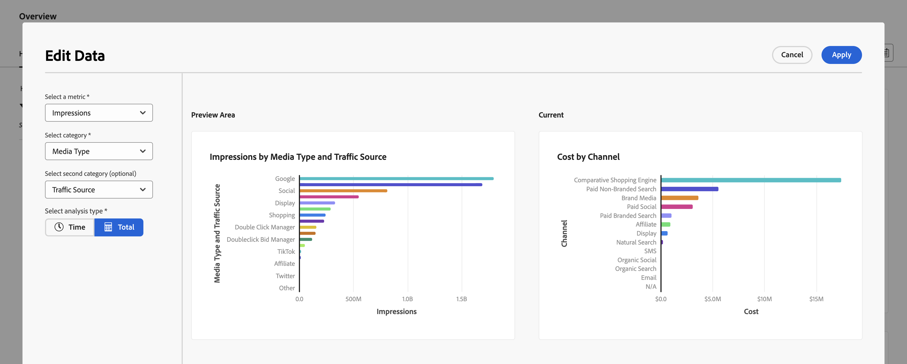

# Översikt över harmoniserade data

Fliken Harmonized Data i Mix Modeler Overview ger insikter om de harmoniserade data som du har konfigurerat för att användas som en del av de importerade data och harmoniserade datainställningarna.

I översikten visas fyra KPI-statuskortswidgetar (översta raden) och sex andra konfigurerbara widgetar.

Om du vill ändra datumperioden för data som ska visas i widgetarna anger du ett startdatum och ett slutdatum manuellt eller väljer en period med .

## Datafilter

Du kan filtrera data som visas för alla widgetar med  **[!UICONTROL Data Filters]** fönster.

Välj ett eller flera filter för varje kategori (**[!UICONTROL Channel]**, **[!UICONTROL Brand]**, **[!UICONTROL Source Type]** och **[!UICONTROL Traffic Source]**).

De valda filtren visas ovanpå widgetarna på **[!UICONTROL FILTERING BY:]**.

1. Om du vill ta bort ett enskilt filter väljer du  på filtret, se **[!UICONTROL FILTERING BY:]**.

1. Du kan snabbt rensa alla filter med **[!UICONTROL Clear All]**.

## Konfigurera en widget

Du kan konfigurera varje widget.

* På KPI-statuskortwidgeten:

   1. Välj  och  **[!UICONTROL Edit Data]** på snabbmenyn.

   1. I **[!UICONTROL KPI status card]** dialog:

      1. Välj en **[!UICONTROL KPI]** från listan.

      1. Välj **[!UICONTROL Apply]** om du vill använda ändringen på kortet. Välj **[!UICONTROL Cancel]** om du vill avbryta ändringen.

* På andra konfigurerbara widgetar:

   1. Välj  och  **[!UICONTROL Edit Data]** på snabbmenyn.

   1. I **[!UICONTROL Edit Data]** dialog:

      1. Välj ett mått från **[!UICONTROL Select a metric]**, till exempel **[!UICONTROL Impressions]**.
      1. Välj en kategori från **[!UICONTROL Select category]**, till exempel **[!UICONTROL Media Type]**.
      1. (valfritt) välj en andra kategori från **[!UICONTROL Select second category (optional)]**, till exempel **[!UICONTROL Traffic Source]**.
      1. Välj  **[!UICONTROL Time]** eller  **[!UICONTROL Total]** som analystyp vid **[!UICONTROL Select analysis type]**.

         Om du väljer  **[!UICONTROL Time]** kan du ange tidsintervall. Välj **[!UICONTROL Daily]**, **[!UICONTROL Weekly]**, **[!UICONTROL Monthly]** eller **[!UICONTROL Quarterly]** från **[!UICONTROL Select time frequency]**.

         Du ser en uppdaterad förhandsvisning av den aktuella markeringen i [!UICONTROL Preview Area] och din aktuella widget under [!UICONTROL Current].

         

         Om förhandsgranskningen inte kan återges på grund av att data inte är tillgängliga visas  [!UICONTROL Insights Not Available] - [!UICONTROL Harmonized fields are not available].

      1. Välj **[!UICONTROL Apply]** för att tillämpa ändringarna på widgeten. Välj **[!UICONTROL Cancel]** om du vill avbryta ändringar som gjorts i den aktuella widgeten.

