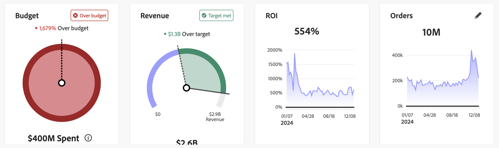

# Prestanda att planera

>[!NOTE]
>
>Fliken **[!UICONTROL Plans]** [!BADGE Alpha]{type=Informative} i Mix Modeler  **[!UICONTROL Overview]** är en alfavärde som kan komma att ändras. Funktionen är tillgänglig för ett begränsat antal kunder.

Fliken **[!UICONTROL Plans]** [!BADGE Alpha]{type=Informative} i Mix Modeler  **[!UICONTROL Overview]** innehåller en kontrollpanel för spårning som du kan använda för att övervaka hur väl marknadsföringen fungerar i förhållande till planen.

Så här väljer du vilka data som ska visas för KPI-statuskort och visualiseringar:

* Välj en plan i listrutan **[!UICONTROL Plan name]** med hjälp av alternativet **[!UICONTROL _Välj en plan.._]**.

* Ange en datumperiod. Om du vill ändra datumperioden anger du ett startdatum och ett slutdatum manuellt eller väljer en datumperiod med .

På fliken **[!UICONTROL Plans]** [!BADGE Alpha]{type=Informative} visas:

* KPI-statuskort

   * [Budget](#budget)
   * [Intäkter](#revenue)
   * [avkastning](#roi)
   * [Beställningar](#orders)

* Visualiseringar:
   * [ROI: Faktisk kontra prognostiserad](#roi-actual-vs-forecasted)
   * [Utgift: Faktisk kontra planerad](#spend-actual-vs-planned)
   * [Avkastning per datumintervall](#roi-by-date-ranges)
   * [Intäkter: Faktisk kontra prognostiserad](#revenue-actual-vs-forecasted)
   * [Faktiskt kontra förväntat efter datumintervall](#actual-vs-predicted-spend-by-date-ranges)
   * [Utgifter efter datumintervall](#spend-by-date-ranges)
   * [Intäkter efter datumintervall](#revenue-by-date-ranges)
   * [Utgifter per datumintervall (och kanaler)](#spend-by-date-ranges-and-channels)

## KPI-statuskort

### Budget

En cirkelformad förloppsvisualisering som visar hur era marknadsföringsutgifter står i jämförelse med budgeten för er plan för datumperioden.

### Intäkter

En cirkulär förloppsvisualisering som visar hur de faktiska intäkterna står i jämförelse med de planerade målintäkterna för datumperioden.

### avkastning

En radvisualisering som visar ROI för datumperioden.

### Beställningar

En radvisualisering som visar order för datumperioden.

Så här väljer du en annan KPI:

1. Välj .
1. Välj en KPI i listrutan **[!UICONTROL KPI]** i dialogrutan **[!UICONTROL KPI status card]**.

## Visualiseringar

### ROI: Faktisk kontra prognostiserad

En radinvisualisering som jämför faktisk avkastning jämfört med prognostiserad avkastning för datumperioden.

### Utgift: Faktisk kontra planerad

En stapeldiagramvisualisering som jämför faktisk utgift jämfört med planerad budget över kanaler för datumperioden.

### Avkastning per datumintervall

En stapeldiagramvisualisering som visar ROI efter datumintervall för datumperioden.

### Intäkter: Faktisk kontra prognostiserad

En radvisualisering som jämför faktisk intäkt med prognostiserad intäkt för datumperioden.

### Faktisk kontra förväntad utgift per datumintervall

En stapeldiagramvisualisering som visar faktisk eller förväntad utgift per datumintervall för datumperioden.

### Utgifter efter datumintervall

En stapeldiagramvisualisering som visar utgifter efter datumintervall för datumperioden.

### Intäkter efter datumintervall

En stapeldiagramvisualisering som visar intäkter efter datumintervall för datumperioden.

### Utgifter per datumintervall och kanaler

En staplad stapeldiagramvisualisering som visar utgifter efter datumintervall och kanal för datumperioden.
