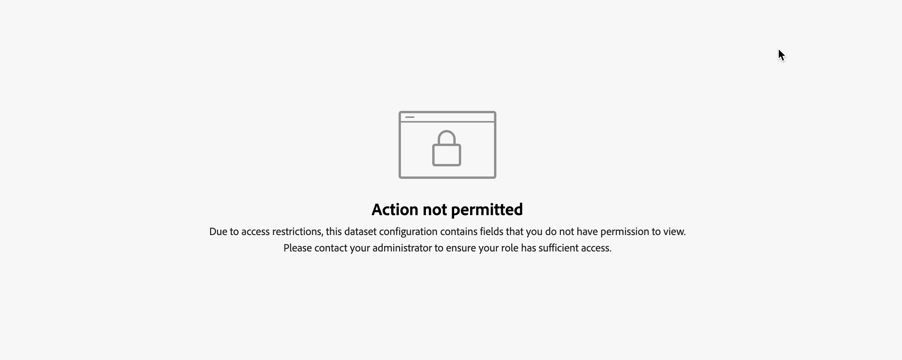

# Datauppsättningsregler

Datauppsättningsreglerna hjälper dig att mappa dina harmoniserade fält till fält från data som du matat in i Mix Modeler.

* För sammanställda data som du har kapslat i Adobe Experience Platform mappar du ett eller flera av de tillgängliga datamängdsfälten till lämpliga harmoniserade fält.
* För händelsedata kan du mappa ett eller flera harmoniserade fält till fält från datauppsättningen, direkt eller med villkor.

## Hantera datauppsättningsregler

Om du vill visa en tabell med tillgängliga datauppsättningsregler i gränssnittet Mix Modeler:

1. Välj  **[!UICONTROL Harmonized data]** från den vänstra listen.

1. Välj **[!UICONTROL Dataset rules]** i det övre fältet. Du ser en tabell med datauppsättningsreglerna.

Tabellkolumnerna anger information om datauppsättningsreglerna:

| Kolumnnamn | Information |
| ---------------------- | ----------|
| Datauppsättning | Datauppsättningens namn. |
| Källa | Källan till datauppsättningen: Adobe Analytics, Experience Events, Summary (sammanställd) eller Consumer Experience Events. |
| Schema | Schemat som datauppsättningen följer. Du kan snabbt välja schemanamnet för att öppna schemat på en ny flik i schemaredigeraren i  [Scheman](../ingest-data/schemas.md). |
| Kornighet | Detaljrikedomen för data i datauppsättningen. Möjliga värden är Daily, Weekly, Monthly eller Yearly. |
| Veckostart | Anger vilken veckodag som betraktas som början av en ny vecka för den specifika datauppsättningen. |
| Status | Fältets status: 
● Utkast eller 
● Aktiv |
| Senast ändrad | Data och tid för den senaste ändringen av datauppsättningsregeln. |

{style="table-layout:auto"}

### Skapa en datauppsättningsregel

Skapa en datauppsättningsregel i  **[!UICONTROL Harmonized data]** > **[!UICONTROL Dataset rules]** i Mix Modeler väljer **[!UICONTROL Create a dataset rule]** i **[!UICONTROL Dataset rules configuration]** guide.

I **[!UICONTROL Create]** skärm,

1. I **[!UICONTROL Dataset details]** väljer du en datauppsättning från **[!UICONTROL Select dataset]** för att börja konfigurationen. I listan kategoriseras datauppsättningar i **[!UICONTROL Consumer Experience Events]**, **[!UICONTROL Adobe Analytics]**, **[!UICONTROL Experience Event]** och **[!UICONTROL Summary]**.

1. Välj en dag för **[!UICONTROL Start of the week]**.

1. Välj **[!UICONTROL Daily]**, **[!UICONTROL Weekly]**, **[!UICONTROL Monthly]** eller **[!UICONTROL Yearly]** for **[!UICONTROL Granularity]**.

1. När du har valt en datauppsättning för **[!UICONTROL Summary]** kategori:

   1. Om du vill definiera om data för datauppsättningen ska aggregeras eller ersätta befintliga data väljer du **[!UICONTROL Aggregation]** eller **[!UICONTROL Replacement]** for **[!UICONTROL Data restatement is by]**.

   1. Avbilda var och en av **[!UICONTROL Available dataset fields]** motsvarar **[!UICONTROL Standard harmonized fields]** in **[!UICONTROL Map to harmonized fields]**. Om du inte vill mappa ett datamängdsfält till ett harmoniserat fält väljer du uttryckligen **[!UICONTROL -- None --]**.

   1. Om du behöver ett nytt harmoniserat fält, som inte är tillgängligt i listan, väljer du **[!UICONTROL Create New]** skapa ett nytt harmoniserat fält. Dialogrutan visas enligt [Lägg till ett nytt harmoniserat fält](fields.md#add-a-harmonized-field).

   1. När mappningen är klar för alla fält för regeln väljer du **[!UICONTROL Save as draft]** om du vill spara ett utkast av regeln eller **[!UICONTROL Save]** för att spara och aktivera regeln. Välj **[!UICONTROL Cancel]** om du vill avbryta regelkonfigurationen.

      

1. När du har valt en händelsekategoridatauppsättning (**[!UICONTROL Experience Events]**, **[!UICONTROL Adobe Analytics]**, **[!UICONTROL Consumer Experience Events]**), i rutan under **[!UICONTROL Map to harmonized fields]**:

   1. Välj ett harmoniserat fält från **[!UICONTROL Standard harmonized field]**.

   1. När det valda harmoniserade fältet är av typen mätvärde:

      1. Välj **[!UICONTROL Count]** eller **[!UICONTROL Sum]** från **[!UICONTROL Mapping type]**.

      1. Välj en **[!UICONTROL *AEP-datamängdsfält *]**som du vill att det harmoniserade fältet ska mappas till som standard.

   1. När det markerade fältet är av typen dimension:

      1. Välj **[!UICONTROL Map Into]** eller **[!UICONTROL Case]** från **[!UICONTROL Mapping type]**.

      1. När du har valt **[!UICONTROL Map Into]**, markera **[!UICONTROL Field]** och **[!UICONTROL *AEP-datamängdsfält *]**eller **[!UICONTROL Value]**och ett standardvärde för att mappa det harmoniserade fältet till datauppsättningsfältet eller det angivna värdet.

      1. När du väljer **[!UICONTROL Case]**, markera **[!UICONTROL Field]** och **[!UICONTROL *AEP-datamängdsfält *]**eller **[!UICONTROL Value]**och ett standardvärde för att mappa det harmoniserade fältet till datauppsättningsfältet eller det angivna värdet.

         1. Om du vill ange värden explicit definierar du ett eller flera fall som består av ett eller flera villkor. Varje villkor kan söka efter en specifik **[!UICONTROL *AEP-datamängdsfält *]**om **[!UICONTROL Exists]**eller **[!UICONTROL Not Exists]**eller om **[!UICONTROL Contains]**,**[!UICONTROL Not Contains]**,**[!UICONTROL Equals]**,**[!UICONTROL Not Equals]**,**[!UICONTROL Starts With]**, eller **[!UICONTROL Ends With]**ett värde angivet på**[!UICONTROL * Ange indatavärde *]**.

         1. Om du vill lägga till ytterligare ett ärende väljer du  **[!UICONTROL Add case]**, om du vill lägga till ytterligare ett villkor väljer du  **[!UICONTROL Add condition]**.

         1. Om du vill ta bort ett ärende eller villkor väljer du  i motsvarande behållare.

         1. Välj om något eller alla villkor ska gälla för ett ärende **[!UICONTROL Any of]** eller **[!UICONTROL All of]**.

         1. Ange resultatvärdet för ett ärende genom att ange värdet **[!UICONTROL Then]**.

      Exemplet nedan

      * använder **[!UICONTROL Map Into]** **[!UICONTROL Mapping type]** för att mappa **[!UICONTROL Channel Type At Source]** harmoniserat fält till **[!UICONTROL channel_type]** fält från **[!DNL Luma Transactions]** datauppsättning.

      * använder **[!UICONTROL Case]** **[!UICONTROL Mapping type]** för att villkorligt mappa värdet för **[!UICONTROL marketing.campaignName]** fältet i **[!DNL Luma Transactions]** datauppsättning till **[!UICONTROL Campaign]** harmoniserat fält. Det harmoniserade fältet Campaign är inställt på:

         * `Black Friday` när **[!UICONTROL marketing.campaignName]** är `_black_friday` eller `BlackFriday`.
         * till värdet av **[!UICONTROL marketing.campaignName]** i alla andra fall.

        

1. Välj  **[!UICONTROL Add field]** för att definiera ytterligare fält.

När du är klar väljer du **[!UICONTROL Save as draft]** om du vill spara ett utkast av regeln eller **[!UICONTROL Save]** för att spara och aktivera regeln. Välj **[!UICONTROL Cancel]** om du vill avbryta regelkonfigurationen.

### Redigera en datauppsättningsregel

Redigera en datauppsättningsregel i  **[!UICONTROL Harmonized data]** > **[!UICONTROL Dataset rules]** gränssnitt i Mix Modeler:

1. Välj  i **[!UICONTROL Dataset]** -kolumn för den datauppsättningsregel som du vill redigera.
1. Välj  **[!UICONTROL Edit]** för att börja redigera datauppsättningsregeln. Se [Skapa en datauppsättningsregel](#create-a-dataset-rule) för mer information.

### Ta bort en datauppsättningsregel

Ta bort en datauppsättningsregel i  **[!UICONTROL Harmonized data]** > **[!UICONTROL Dataset rules]** gränssnitt i Mix Modeler:

1. Välj  i **[!UICONTROL Dataset]** kolumn för datauppsättningsregeln som du vill ta bort.
1. Välj  **[!UICONTROL Delete]** för att ta bort datauppsättningsregeln. Du uppmanas att bekräfta åtgärden. Välj **[!UICONTROL Delete]** om du vill ta bort den markerade datauppsättningsregeln permanent.

## Synkronisera data

Om du vill synkronisera data mellan harmoniserade data och sammanfattningar och/eller händelsedatamängder följer du all logik i datauppsättningsreglerna:

1. Välj **[!UICONTROL Sync data]**.

1. Från **[!UICONTROL Sync data for dataset rules]** dialogruta, välja
   * **[!UICONTROL Refresh harmonized data for summary datasets]**,
   * **[!UICONTROL Refresh harmonized data for event datasets]**, eller
   * **[!UICONTROL Refresh harmonized data for both summary + event datasets]**.

1. Om du vill starta synkroniseringen baserat på definierade datauppsättningsregler mellan harmoniserade data och data i datauppsättningar väljer du **[!UICONTROL Sync]**. Om du vill avbryta synkroniseringen väljer du **[!UICONTROL Cancel]**.

   

## Inställningar för datasammanfogning

>[!NOTE]
>
>[!BADGE beta]{type=Informative}

Inställningarna för datasammanfogning hjälper till att lösa konflikter när data från sammanfogade data och händelsesdatakällor sammanfogas. Användningsexempel:

* samma reklammått mäts och rapporteras i flera datauppsättningar, eller
* Måtten kan vara ofullständiga i vissa datauppsättningar, medan en annan datauppsättning kan vara en övermängd av ett visst mått, vilket resulterar i dubbelräkning.

För att få korrekta modellprognoser kan du definiera inställningar för datasammanfogning:

1. Välj  [!BADGE beta].

1. I **[!UICONTROL Data merge preferences]** [!BADGE beta]{type=Informative}

   

   * Välj en **[!UICONTROL Default metric preference]**. Den valda standardinställningen för mätvärden används när flera datakällor uppdaterar ett mätfält för en viss kanal under harmonisering. Inställningen används på sandlådenivå, såvida den inte åsidosätts för specifika måttbaserade inställningar. Du kan välja mellan **[!UICONTROL Summary data]**, **[!UICONTROL Event data]** och **[!UICONTROL Sum of summmary and event data]**.

   * Så här lägger du till specifika måttbaserade inställningar:

      1. Välj  **[!UICONTROL Add a metric]**.
         1. Välj ett mått på menyn **[!UICONTROL *Val av mått *]**lista.
         1. Välj **[!UICONTROL CHANNELS]** eller **[!UICONTROL CONVERSION TYPES]**. Välj **[!UICONTROL All]** eller en viss kanal eller konverteringstyp.
         1. Välj **[!UICONTROL Summary]** eller **[!UICONTROL Event]** om du vill ange om sammanfattningsdata eller händelsedata ska prioriteras för måttet (och för alla eller valda kanaler) när data sammanfogas.

         Så här lägger du till en eller flera ytterligare kanal- eller konverteringstyper:

         1. Välj  **[!UICONTROL Add a channel]** eller  **[!UICONTROL Add a conversion type]**.
         1. Välj **[!UICONTROL Summary]** eller **[!UICONTROL Event]**.

         Om du vill ta bort en kanal eller konverteringstyp väljer du .

      1. Om du vill lägga till mer specifika måttbaserade inställningar upprepar du föregående steg.

   * Om du vill ta bort en befintlig specifik måttbaserad inställning väljer du .

1. Välj **[!UICONTROL Save]** om du vill spara inställningarna för datasammanfogning. En omsynkronisering av data initieras.  Välj **[!UICONTROL Cancel]** för att avbryta.

## Åtkomstkontroll på fältnivå

När datauppsättningsregler konfigureras för harmoniserade datauppsättningar, Experience Platform [attributbaserad åtkomstkontroll](https://experienceleague.adobe.com/en/docs/experience-platform/access-control/abac/overview) används på fältnivå. Ett fält är begränsat när en etikett är kopplad till ett schemafält och en aktiv princip är aktiverad som nekar dig åtkomst till det fältet. Resultatet blir:

* du inte ser de schemafält som är begränsade för dig när du skapar en datauppsättningsregel,
* du inte kan visa eller redigera mappningen av ett eller flera schemafält som är begränsade för dig. När du redigerar eller visar en datauppsättningsregel som innehåller sådana begränsade fält visas följande skärm.
  
