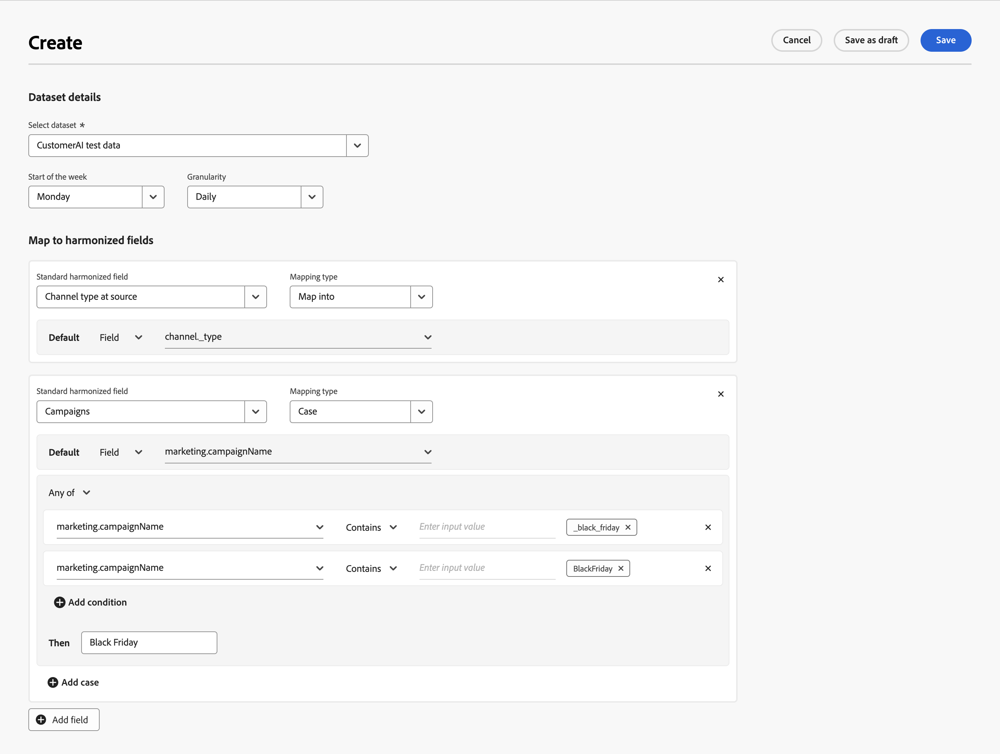

# Datauppsättningsregler

Datauppsättningsreglerna hjälper dig att mappa dina harmoniserade fält till fält från data som du matat in i Mix Modeler.

* För sammanställda data som du har kapslat i Adobe Experience Platform mappar du ett eller flera av de tillgängliga datamängdsfälten till lämpliga harmoniserade fält.
* För händelsedata kan du mappa ett eller flera harmoniserade fält till fält från datauppsättningen, direkt eller med villkor.

## Hantera datauppsättningsregler och mappningar

Om du vill visa en tabell med tillgängliga datamängdsmappningar i Mix Modeler-gränssnittet:

1. Välj  **[!UICONTROL Harmonized data]** från den vänstra listen.

1. Välj **[!UICONTROL Dataset rules]** i det övre fältet. Du ser en tabell med datamängdsmappningar.

Tabellkolumnerna anger information om datamängdsmappningarna:

| Kolumnnamn | Information |
| ---------------------- | ----------|
| Datauppsättning | Datauppsättningens namn. |
| Källa | Källan till datauppsättningen, som kan vara Adobe Analytics, Experience Events, Summary (sammanställning) eller Consumer Experience Events. |
| Schema | Schemat som datauppsättningen följer. Du kan snabbt välja schemanamnet för att öppna schemat på en ny flik i schemaredigeraren i Mix Modeler - Scheman. |
| Kornighet | Detaljrikedomen för data i datauppsättningen. Möjliga värden är Daily, Weekly, Monthly eller Yearly. |
| Veckostart | Anger vilken veckodag som betraktas som början av en ny vecka för den specifika datauppsättningen. |
| Senast ändrad | Data och tid för den senaste ändringen av datamängdsmappningen. |

{style="table-layout:auto"}

### Skapa en datamängdsmappning

Skapa en datamängdsmappning i  **[!UICONTROL Harmonized data]** > **[!UICONTROL Dataset rules]** i Mix Modeler väljer **[!UICONTROL Create Dataset Mapping]**.

I **[!UICONTROL Create]** skärm,

1. I **[!UICONTROL Dataset Details]** väljer du en datauppsättning från **[!UICONTROL Select dataset]** för att börja konfigurationen.

1. Välj en dag för **[!UICONTROL Start of the week]**.

1. Välj **[!UICONTROL Daily]**, **[!UICONTROL Weekly]**, **[!UICONTROL Monthly]** eller **[!UICONTROL Yearly]** for **[!UICONTROL Granularity]**.

1. När du har valt en **[!UICONTROL Summary]** typ av datauppsättning:

   1. Avbilda var och en av **[!UICONTROL Available dataset fields]** motsvarar **[!UICONTROL Standard harmonized fields]**. Om du inte vill mappa ett datamängdsfält till ett harmoniserat fält väljer du uttryckligen **[!UICONTROL -- None --]**.

   1. Om du behöver ett nytt harmoniserat fält, som inte är tillgängligt i listan, väljer du **[!UICONTROL Create New]** skapa ett nytt harmoniserat fält. Dialogrutan visas enligt [Lägg till ett nytt harmoniserat fält](fields.md#add-a-harmonized-field) för att snabbt kunna lägga till ett nytt harmoniserat fält.

   1. När mappningen är klar för alla fält väljer du **[!UICONTROL Save]**. Välj **[!UICONTROL Cancel]** för att avbryta mappningen.

      

1. När du har valt en händelsetyp (**[!UICONTROL Experience Events]**, **[!UICONTROL Adobe Analytics]**, **[!UICONTROL Consumer Experience Events]**), i den skuggade rutan under **[!UICONTROL Map to harmonized fields]**:

   1. Välj ett harmoniserat fält från **[!UICONTROL Standard harmonized field]**.

   1. När det valda harmoniserade fältet är av typen mätvärde:

      1. Välj **[!UICONTROL Count]** eller **[!UICONTROL Sum]** från **[!UICONTROL Mapping type]**.

      1. Välj en **[!UICONTROL *AEP-datamängdsfält *]**som du vill att det harmoniserade fältet ska mappas till som standard.

   1. När det markerade fältet är av typen dimension:

      1. Välj **[!UICONTROL Map Into]** eller **[!UICONTROL Case]** från **[!UICONTROL Mapping type]**.

      1. När du har valt **[!UICONTROL Map Into]**, markera **[!UICONTROL Field]** och **[!UICONTROL *AEP-datamängdsfält *]**eller **[!UICONTROL Value]**och ett standardvärde för att mappa det harmoniserade fältet till datauppsättningsfältet eller det angivna värdet.

      1. När du har valt **[!UICONTROL Case]**, markera **[!UICONTROL Field]** och **[!UICONTROL *AEP-datamängdsfält *]**eller **[!UICONTROL Value]**och ett standardvärde för att mappa det harmoniserade fältet till datauppsättningsfältet eller det angivna värdet.

         1. Du definierar också ett eller flera fall som består av ett eller flera villkor som uttryckligen anger värden. Varje villkor kan söka efter en specifik **[!UICONTROL *AEP-datamängdsfält *]**om **[!UICONTROL Exists]**eller **[!UICONTROL Not Exists]**eller om **[!UICONTROL Contains]**,**[!UICONTROL Not Contains]**,**[!UICONTROL Equals]**,**[!UICONTROL Not Equals]**,**[!UICONTROL Starts With]**, eller **[!UICONTROL Ends With]**ett värde angivet på**[!UICONTROL * Ange indatavärde *]**.

         1. Om du vill lägga till ytterligare ett ärende väljer du  **[!UICONTROL Add case]**, om du vill lägga till ytterligare ett villkor väljer du  **[!UICONTROL Add condition]**.

         1. Om du vill ta bort ett ärende eller villkor väljer du  i motsvarande behållare.

         1. Välj om något eller alla villkor ska gälla för ett ärende **[!UICONTROL Any of]** eller **[!UICONTROL All of]**.

         1. Ange resultatvärdet för ett ärende genom att ange värdet **[!UICONTROL Then]**.

      Exemplet nedan

      * använder **[!UICONTROL Map Into]** **[!UICONTROL Mapping type]** för att mappa **[!UICONTROL Channel Type At Source]** harmoniserat fält till **[!UICONTROL channel_type]** fält från **[!DNL Luma Transactions]** datauppsättning.

      * använder **[!UICONTROL Case]** **[!UICONTROL Mapping]** typ för villkorlig mappning av värdet för **[!UICONTROL marketing.campaignName]** fältet i **[!DNL Luma Transactions]** datauppsättning till **[!UICONTROL Campaign]** harmoniserat fält. Det harmoniserade fältet Campaign är inställt på:

         * `Black Friday` när **[!UICONTROL marketing.campaignName]** är `_black_friday` eller `BlackFriday`.
         * till värdet av **[!UICONTROL marketing.campaignName]** i alla andra fall.

        

1. Välj  **[!UICONTROL Add field]** för att definiera ytterligare fält.

När du är klar väljer du **[!UICONTROL Save]** för att spara mappningen, eller markera **[!UICONTROL Cancel]** för att avbryta mappningen.

### Redigera en datamängdsmappning

Redigera en datamängdsmappning i  **[!UICONTROL Harmonized data]** > **[!UICONTROL Dataset rules]** gränssnitt i Mix Modeler:

1. Välj  i **[!UICONTROL Dataset]** -kolumn för den datamängdsmappning som du vill redigera.
1. Välj  **[!UICONTROL Edit]** för att börja redigera datamängdsmappningen. Se [Skapa en datamängdsmappning](#create-a-dataset-mapping) för mer information.

### Ta bort en datamängdsmappning

Ta bort en datamängdsmappning i  **[!UICONTROL Harmonized data]** > **[!UICONTROL Dataset rules]** gränssnitt i Mix Modeler:

1. Välj  i **[!UICONTROL Dataset]** -kolumn för den datamängdsmappning som du vill ta bort.
1. Välj  **[!UICONTROL Delete]** för att ta bort datamängdsmappningen.

## Synkronisera data

Om du vill synkronisera data mellan harmoniserade data och sammanfattningar och/eller händelsedatamängder följer du all logik i datauppsättningsreglerna:

1. Välj **[!UICONTROL Sync data]**.

1. Från **[!UICONTROL Sync data for dataset rules]** väljer du antingen **[!UICONTROL Refresh harmonized data for summary datasets]**, **[!UICONTROL Refresh harmonized data for event datasets]**, eller **[!UICONTROL Refresh harmonized data for both summary + event datasets]**.

1. Välj **[!UICONTROL Sync]** att starta synkroniseringen baserat på definierade datauppsättningsregler mellan harmoniserade data och data i datauppsättningar. Om du vill avbryta synkroniseringen väljer du **[!UICONTROL Cancel]**.

   
