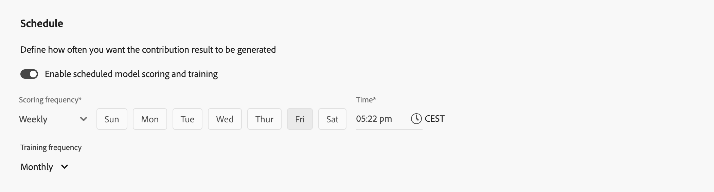

# Skapa modeller

Gränssnittet ger ett stegvis guidat modellkonfigurationsflöde när du vill skapa anpassade AI-baserade modeller.

I gränssnittet  **[!UICONTROL Models]** i Mix Modeler väljer du **[!UICONTROL Open model canvas]**.

## Inställningar

Du definierar ett namn och en beskrivning i **[!UICONTROL Setup]**-steget:

1. Ange modellen **[!UICONTROL Name]**, till exempel `Demo model`. Ange en **[!UICONTROL Description]**, till exempel `Demo model to explore AI features of Mix Modeler`.

   

1. Välj **[!UICONTROL Next]** om du vill fortsätta till nästa steg. Välj **[!UICONTROL Cancel]** om du vill avbryta modellkonfigurationen.

## Konfigurera{#configure}

>[!CONTEXTUALHELP]
>id="model_marketingtouchpoints_select"
>title="Marknadsföringskontaktytor"
>abstract="Marknadsföringskontaktytorna är marknadshändelser på mottagarnivå, individ- och cookienivå som används för att utvärdera effekten av marknadsinvesteringar på numeriska eller intäktsbaserade konverteringar.  Du kan inte konfigurera modellen med kontaktytor som har överlappande data och det måste finnas minst en kontaktyta med utgift."

Du konfigurerar modellen i steget **[!UICONTROL Configure]**. Konfiguration innefattar definition av konverteringsmål, kontaktytor för marknadsföring, den stödberättigade datapopulationen, externa och interna faktorer, med mera.

1. I avsnittet **[!UICONTROL Conversion goal]**:

   

   1. Välj en konvertering i listrutan **[!UICONTROL Conversion]**. De tillgängliga konverteringarna är konverteringen som du definierade som en del av [Konverteringar](../harmonize-data/conversions.md) i [!UICONTROL Harmonized datasets]. Exempel: **[!UICONTROL Online Conversion]**.

   1. Du kan välja  **[!UICONTROL Create a conversion]** om du vill skapa en konvertering direkt från modellkonfigurationen.

1. I avsnittet **[!UICONTROL Marketing touchpoints]** kan du välja en eller flera kontaktytor för marknadsföring, som motsvarar de kontaktytor för marknadsföring som du har definierat som en del av [Marknadsföringskontaktytor](../harmonize-data/marketing-touchpoints.md) i [!UICONTROL Harmonized datasets].

   

   1. Välj en eller flera kontaktytor för marknadsföring i listrutan **[!UICONTROL Touchpoint include]**.

      * Du kan använda  för att ta bort en kontaktyta.
      * Du kan använda **[!UICONTROL Clear all]** för att ta bort alla kontaktytor.

   1. Du kan välja  **[!UICONTROL Create a touchpoint]** om du vill skapa en marknadsföringskontaktyta direkt från modellkonfigurationen.

   >[!NOTE]
   >
   >Du kan inte ställa in modellen med kontaktytor som har överlappande data och det måste finnas minst en kontaktyta med utgifter.

1. Som standard genereras en poäng för alla data i din harmoniserade vy. Om du bara vill poängsätta en delmängd av populationen definierar du ett eller flera filter med hjälp av behållare i avsnittet **[!UICONTROL Eligible data population]**.

   

   * Definiera en eller flera händelser för varje behållare.

      1. För varje händelse:

         1. Välj ett mått eller en dimension från **[!UICONTROL _Välj harmoniserat fält_]**.

         1. Välj lämplig operator: **[!UICONTROL equals]**, **[!UICONTROL not equals]**, **[!UICONTROL less than]**, **[!UICONTROL greater than]**, **[!UICONTROL starts with]**, **[!UICONTROL doesn't start with]**, **[!UICONTROL ends with]**, **[!UICONTROL doesn't end with]**, **[!UICONTROL contains]**, **[!UICONTROL doesn't contain]**, **[!UICONTROL is in]** eller **[!UICONTROL is not in]**.

         1. Ange eller välj ett värde vid **[!UICONTROL _Ange eller välj värdet_]**.

      1. Om du vill lägga till ytterligare en händelse i behållaren väljer du  **[!UICONTROL Add event]**.

      1. Om du vill ta bort en händelse från behållaren väljer du .

      1. Om du vill filtrera med hjälp av alla eller några av flera händelser som definieras i behållaren väljer du **[!UICONTROL Any of]** eller **[!UICONTROL All of]**. Etiketten ändras på motsvarande sätt från **[!UICONTROL Include ... Or ...]** till **[!UICONTROL Include ... And ...]**.

   * Välj  **[!UICONTROL Add eligible population]** om du vill lägga till en giltig dataifyllningsbehållare.

   * Om du vill ta bort en giltig dataifyllningsbehållare i behållaren väljer du  och sedan **[!UICONTROL Remove container]** på snabbmenyn.

   * Välj **And** och **Or** mellan behållare om du vill skapa mer komplexa definitioner för den giltiga datapifyllningen.

1. Om du vill lägga till datauppsättningar som innehåller externa faktorer i modellen använder du en eller flera behållare i avsnittet **[!UICONTROL External factors dataset]**. Ett exempel på externa faktorer är S&amp;P-index.

   

   * För varje behållare:

      1. Ange en **[!UICONTROL External factor name]**, till exempel `External Factors`.

      1. Välj en datauppsättning i listrutan **[!UICONTROL Dataset]**. Du kan välja  för att hantera datamängder. Mer information finns i [Datauppsättningar](../ingest-data/datasets.md).

      1. Välj ett alternativ i listrutan **[!UICONTROL Impact on conversion]**: **[!UICONTROL Auto select]**, **[!UICONTROL Positive]** eller **[!UICONTROL Negative]**. Standardalternativet är **[!UICONTROL Auto select]**, vilket gör att modellen kan avgöra påverkan. Du kan åsidosätta standardinställningen.

   * Om du vill lägga till ytterligare en datauppsättningsbehållare för externa faktorer väljer du  **[!UICONTROL Add external factor]**.

   * Välj  om du vill ta bort en datauppsättningsbehållare för externa faktorer.

1. Om du vill lägga till datauppsättningar som innehåller interna faktorer i modellen använder du en eller flera behållare i avsnittet **[!UICONTROL Internal factors dataset]**. Ett exempel på interna faktorer är marknadsföringsdata för e-post.

   

   * För varje behållare:

      1. Ange en **[!UICONTROL Internal factor name]**, till exempel `Email Marketing Data`.

      1. Välj en datauppsättning från **[!UICONTROL _Välj en datauppsättning_]**. Du kan välja  för att hantera datamängder. Mer information finns i [Datauppsättningar](../ingest-data/datasets.md).

      1. Välj ett alternativ i listrutan **[!UICONTROL Impact on conversion]**: **[!UICONTROL Auto select]**, **[!UICONTROL Positive]** eller **[!UICONTROL Negative]**.

   * Om du vill lägga till ytterligare en datauppsättningsbehållare för interna faktorer väljer du  **[!UICONTROL Add internal factor]**.

   * Välj  om du vill ta bort en datauppsättningsbehållare för interna faktorer.

1. Ange ett värde mellan `1` och `52` i **[!UICONTROL Give contribution credit to touchpoints occurring within]** ... **[!UICONTROL weeks prior to the conversion]** om du vill definiera uppslagsfönstret för modellen.

1. Välj **[!UICONTROL Next]** om du vill fortsätta till nästa steg. Om mer konfiguration behövs, förklarar en röd kontur och text vilken ytterligare konfiguration som krävs.  Välj **[!UICONTROL Back]** om du vill gå tillbaka till föregående steg.  Välj **[!UICONTROL Cancel]** om du vill avbryta modellkonfigurationen.

## Avancerat

Du kan ange avancerade inställningar i steget **[!UICONTROL Advanced]**. I det här steget kan du aktivera din modell för multitouch-attribuering (MTA).

1. I avsnittet **[!UICONTROL Spend share]**:

   * Aktivera **[!UICONTROL Allow spend share]** om du vill använda tidigare investeringsförhållanden för marknadsföring för att informera modellen när marknadsföringsdata är begränsade. Den här inställningen rekommenderas, särskilt i följande scenarier:
      * En kanal har inte tillräckligt många observationer (t.ex. låg frekvens av utgifter, visningar eller klick).
      * Du modellerar spiky men regular och potentiellt högspenderade media (som TV för vissa varumärken), där data kan vara glesa.

     >[!NOTE]
     >
     >För engångsinvesteringar (t.ex. en Super Bowl-annons) bör du överväga att lägga in dessa data som en faktor i stället för att förlita dig på kostnadsandelen.
     >

1. I avsnittet **[!UICONTROL MTA enabled]**:

   * Aktivera **[!UICONTROL MTA enabled]** om du vill aktivera MTA-funktioner för modellen. Om du har aktiverat MTA finns multitouch-attribueringsinsikter tillgängliga efter att du har utbildat och betygsatt modellen. Se fliken [Attribution](insights.md#attribution) i [Model insights](insights.md).

1. I avsnittet **[!UICONTROL Prior knowledge]**:

   

   1. Välj **[!UICONTROL Rule type]**, som är standard **[!UICONTROL Absolute values]**.

   1. Ange procentsatser för bidrag för någon av kanalerna som listas under **[!UICONTROL Name]**, med kolumnen **[!UICONTROL Contribution proportion]**.

   1. Om det är lämpligt kan du lägga till **[!UICONTROL Level of confidence]** procent för varje kanal.

   1. Använd **[!UICONTROL Clear all]** vid behov för att rensa alla indatavärden för kolumnerna **[!UICONTROL Contribution proportion]** och **[!UICONTROL Level of confidence]**.

## Ange alternativ

Du kan [schemalägga utbildning och poängsättning](#schedule), [definiera utbildningsfönstret](#training-window) och ange [detaljerade insikter, rapportfält](#granular-insights-reporting-fields) för modellen i steget **[!UICONTROL Set options]**.

### Schema

I avsnittet **[!UICONTROL Schedule]** kan du schemalägga modellutbildning och poängsättning.

Så här schemalägger du betygsättning och utbildning:

1. Aktivera **[!UICONTROL Enable scheduled model scoring and training]**.
1. Välj en **[!UICONTROL Scoring frequency]**:

   * **[!UICONTROL Daily]**: Ange en giltig tid (till exempel `05:22 pm`) eller använd .
   * **[!UICONTROL Weekly]**: Välj en veckodag och ange en giltig tid (till exempel `05:22 pm`) eller använd .
   * **[!UICONTROL Monthly]**: Välj en dag i månaden i listrutan Kör på varje och ange en giltig tid (till exempel `05:22 pm`) eller använd .

1. Välj en **[!UICONTROL Training frequency]** i listrutan: **[!UICONTROL Monthly]**, **[!UICONTROL Quarterly]**, **[!UICONTROL Yearly]** eller **[!UICONTROL None]**.

### Utbildningsfönster

I avsnittet **[!UICONTROL Define training window]** väljer du mellan:

* **[!UICONTROL Have Mix Modeler select a helpful training window]** och

* **[!UICONTROL Manually input a training window]**. Ange antalet år i **[!UICONTROL Include events the following years prior to a conversion]** när du väljer det här alternativet.

### Rapporteringsfält för detaljerade insikter

Avsnittet **[!UICONTROL Granular insights reporting fields]** använder rapportfunktionen för detaljerad inkrementalitet. Med den här funktionen kan du välja harmoniserade fält för indelning av konverteringar och poäng för inkrementalitet.

Du definierar dessa harmoniserade fält så att du kan gå nedåt i modellrapporteringen med hjälp av detaljerade rapportkolumner i stället för att behöva skapa separata modeller.

Du kan till exempel skapa en modell som fokuserar på intäkter, men du är också intresserad av kampanjernas, medietyperna, regionerna och trafikkällornas prestanda. Utan den detaljerade inkrementalitetsrapporteringen skulle du behöva skapa fyra separata modeller. Med den detaljerade funktionen för inkrementalitetsrapportering kan ni dela upp intäktsmodellen för kampanjer, medietyper, regioner och trafikkällor.

1. Välj ett eller flera harmoniserade fält från **[!UICONTROL _Välj harmoniserade fält_]** under **[!UICONTROL Includes]**. De valda harmoniserade fälten läggs till på panelen.
1. Välj **[!UICONTROL *Harmoniserat fält *]** om du vill ta bort ett harmoniserat fält från behållaren med de valda harmoniserade fälten.
1. Välj **[!UICONTROL Clear all]** om du vill ta bort alla markerade harmoniserade fält.

De valda harmoniserade fälten för detaljerad tillväxtrapportering är tillgängliga som en del av Experience Platform [schema](/help/ingest-data/schemas.md) och [datamängd](/help/ingest-data/datasets.md) som är ett resultat av att modellen bedömts. Rapporteringsfälten för detaljerade insikter finns i objekten **[!UICONTROL conversionPassthrough]** och **[!UICONTROL touchpointPassthrough]**.

## Slutför

* Välj **[!UICONTROL Finish]** för att slutföra modellkonfigurationen.

   * I dialogrutan **[!UICONTROL Create instance?]** väljer du **[!UICONTROL Ok]** för att utlösa den första uppsättningen kurser och poäng direkt. Din modell visas med statusen  **[!UICONTROL Awaiting training]**.

     Välj **[!UICONTROL Cancel]** om du vill avbryta.

   * Om mer konfiguration behövs, förklarar en röd kontur och text vilken ytterligare konfiguration som krävs.

* Välj **[!UICONTROL Back]** om du vill gå tillbaka till föregående steg.

* Välj **[!UICONTROL Cancel]** om du vill avbryta modellkonfigurationen.

