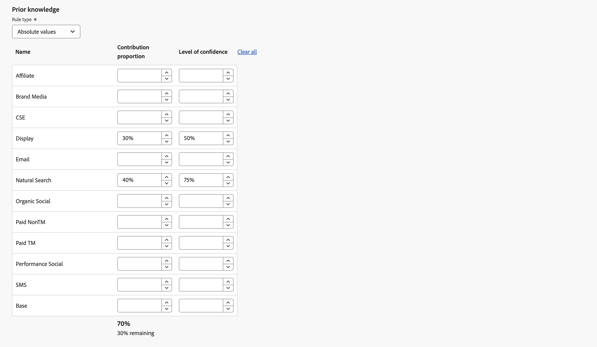

# Skapa en modell

Skapa en modell i  **[!UICONTROL Models]** i Mix Modeler väljer **[!UICONTROL Open model canvas]**.

Gränssnittet ger ett stegvis guidat modellkonfigurationsflöde när du vill skapa anpassade AI-baserade modeller.

1. I **[!UICONTROL Setup]** steg:

   1. Ange din modell **[!UICONTROL Name]**, till exempel `Demo model`. Ange en **[!UICONTROL Description]**, till exempel `Demo model to explore AI featues of Mix Modeler`.

      

   1. Välj **[!UICONTROL Next]** fortsätta till nästa steg. Välj **[!UICONTROL Cancel]** för att avbryta modellkonfigurationen.

1. I **[!UICONTROL Configured]** steg:

   1. I **[!UICONTROL Conversion goal]** i behållaren:

      1. Ange en **[!UICONTROL Conversion name]** för konverteringen, till exempel `Conversion`

      1. Välj en konvertering från **[!UICONTROL *Välj harmoniserat fält *]**, som innehåller de konverteringar du definierat som en del av [Konverteringar](../harmonize-data/conversions.md) in [!UICONTROL Harmonized datasets]. Exempel,**[!UICONTROL Online Conversion]**.

      1. Du kan välja  **[!UICONTROL Create new conversion]** för att skapa en konvertering direkt från modellkonfigurationen.

         

   1. I **[!UICONTROL Marketing touchpoints]** visas ett antal kontaktpunktsbehållare för marknadsföring, som motsvarar de kontaktytor du definierat som en del av [Marknadsföringskontaktytor](../harmonize-data/marketing-touchpoints.md) in [!UICONTROL Harmonized datasets].

      * För varje behållare:

         1. Du kan ändra **[!UICONTROL Marketing touchpoint name]**.

         1. Välj en kontaktyta för marknadsföring från **[!UICONTROL _Markera kontaktyta för marknadsföring_]**.

         1. Du kan välja  **[!UICONTROL Create new marketing touchpoint]** för att skapa en kontaktyta för marknadsföring direkt inifrån modellkonfigurationen.

      * Om du vill lägga till en kontaktpunktsbehållare för marknadsföring väljer du  **[!UICONTROL Add marketing touchpoint]**.

      * Om du vill ta bort en kontaktpunktsbehållare för marknadsföring, i behållaren, väljer du och markera **[!UICONTROL Remove container]** på snabbmenyn.

        

   1. Som standard genereras en poäng för alla data i din harmoniserade vy. Om du bara vill poängsätta en delmängd av populationen definierar du ett eller flera filter med hjälp av behållare i **[!UICONTROL Eligible data population]** -avsnitt.

      * Definiera en eller flera händelser för varje behållare.

         1. För varje händelse:

            1. Välj mått eller dimension från **[!UICONTROL _Välj harmoniserat fält_]**.

            1. Välj lämplig operator: **[!UICONTROL equals]**, **[!UICONTROL not equals]**, **[!UICONTROL less than]**, **[!UICONTROL greater than]**, **[!UICONTROL starts with]**, **[!UICONTROL doesn't start with]**, **[!UICONTROL ends with]**, **[!UICONTROL doesn't end with]**, **[!UICONTROL contains]**, **[!UICONTROL doesn't contain]**, **[!UICONTROL is in]**, eller **[!UICONTROL is not in]**.

            1. Ange eller välj ett värde vid **[!UICONTROL _Ange eller välj värde_]**.

         1. Om du vill lägga till ytterligare en händelse i behållaren väljer du  **[!UICONTROL Add event]**.

         1. Om du vill ta bort en händelse från behållaren väljer du .

         1. Om du vill filtrera med hjälp av alla eller några av flera händelser som definieras i behållaren väljer du **[!UICONTROL Any of]** eller **[!UICONTROL All of]**. Etiketten ändras därefter från **[!UICONTROL Include ... Or ...]** till **[!UICONTROL Include ... And ...]**.

      * Om du vill lägga till en giltig behållare för ifyllning av data väljer du  **[!UICONTROL Add eligible population]**.

      * Om du vill ta bort en lämplig behållare för ifyllning av data i behållaren väljer du och markera **[!UICONTROL Remove container]** på snabbmenyn.

        

   1. Om du vill lägga till datauppsättningar som innehåller externa faktorer i modellen använder du en eller flera behållare i **[!UICONTROL External factors dataset]** -avsnitt.

      * För varje behållare:

         1. Ange en **[!UICONTROL Factor name]** på **[!UICONTROL _Ange faktor_]**.

         1. Välj en datauppsättning från **[!UICONTROL _Välj en datauppsättning_]**. Du kan välja  för att hantera datauppsättningar. Se [Datauppsättningar](../ingest-data/datasets.md) för mer information.

      * Om du vill lägga till ytterligare en datauppsättningsbehållare för externa faktorer väljer du  **[!UICONTROL Add external factor]**.

      * Om du vill ta bort en datauppsättningsbehållare för externa faktorer i behållaren väljer du och markera **[!UICONTROL Remove container]** på snabbmenyn.

        

   1. Om du vill lägga till datauppsättningar som innehåller interna faktorer i modellen använder du en eller flera behållare i **[!UICONTROL Internal factors dataset]** -avsnitt.

      * För varje behållare:

         1. Ange en **[!UICONTROL Factor name]** på **[!UICONTROL _Ange faktor_]**.

         1. Välj en datauppsättning från **[!UICONTROL _Välj en datauppsättning_]**. Du kan välja  för att hantera datauppsättningar. Se [Datauppsättningar](../ingest-data/datasets.md) för mer information.

      * Om du vill lägga till ytterligare en datauppsättningsbehållare för interna faktorer väljer du  **[!UICONTROL Add internal factor]**.

      * Om du vill ta bort ytterligare en datauppsättningsbehållare för interna faktorer, i behållaren, väljer du och **[!UICONTROL Remove container]** på snabbmenyn.

        

   1. Ange ett värde mellan `1` och `52` in **[!UICONTROL Give contribution credit to touchpoints occurring within]** ... **[!UICONTROL weeks prior to the conversion]**.

   1. Välj **[!UICONTROL Next]** fortsätta till nästa steg. Om mer konfiguration behövs, förklarar en röd kontur och text vilken ytterligare konfiguration som krävs.  Välj **[!UICONTROL Back]** för att gå tillbaka till föregående steg.  Välj **[!UICONTROL Cancel]** för att avbryta modellkonfigurationen.

1. I **[!UICONTROL Advanced]** steg:

   1. I **[!UICONTROL Define training window]** avsnitt, välja mellan

      * **[!UICONTROL Have Mix Modeler select a helpful training window]** och 

      * **[!UICONTROL Manually input a training window]**. När du väljer det här alternativet anger du antalet år i **[!UICONTROL Include events the following years prior to a conversion]**.

        

   1. I **[!UICONTROL Spend share]** avsnitt:

      * Aktivera för att använda tidigare investeringsförhållanden för marknadsföring för att informera modellen när marknadsföringsdata är begränsade **[!UICONTROL Allow spend share]**.

   1. I **[!UICONTROL Prior knowledge]** avsnitt:

      1. Välj **[!UICONTROL Rule type]**.

      1. Ange procentsatser för bidrag för någon av kanalerna som listas under **[!UICONTROL Name]**, med **[!UICONTROL Contribution proportion]** kolumn.

      1. Om det behövs kan du lägga till en **[!UICONTROL Level of confidence]** procent.

      1. Använd vid behov **[!UICONTROL Clear all]** för att rensa alla indatavärden för **[!UICONTROL Contribution proportion]** och **[!UICONTROL Level of confidence]** kolumner.

         

1. Välj **[!UICONTROL Finish]** för att slutföra modellkonfigurationen.

   * I **[!UICONTROL Create instance?]** dialogruta, välja **[!UICONTROL Ok]** för att få igång den första uppsättningen kurser och poängsiffror direkt. Din modell har statusen ● **[!UICONTROL Awaiting training]**.

     Välj **[!UICONTROL Cancel]** för att avbryta.

   * Om mer konfiguration behövs, förklarar en röd kontur och text vilken ytterligare konfiguration som krävs.

   Välj **[!UICONTROL Back]** för att gå tillbaka till föregående steg.

   Välj **[!UICONTROL Cancel]** för att avbryta modellkonfigurationen.
