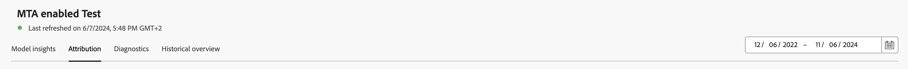
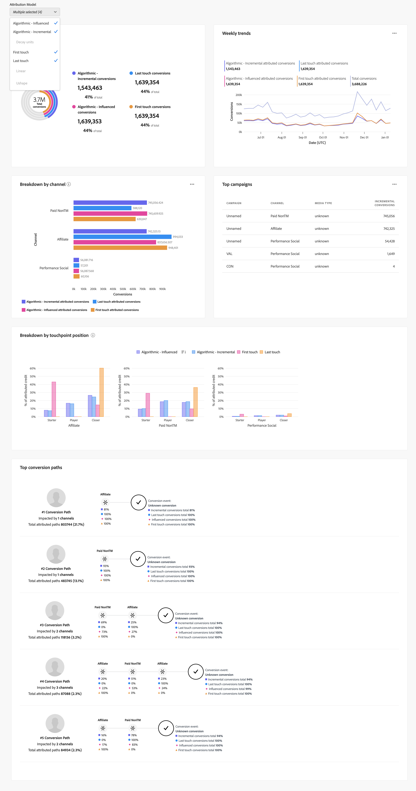

# Modellinsikter

Visa modellinsikter i  **[!UICONTROL Models]** gränssnitt i Mix Modeler:

1. Från **[!UICONTROL Models]** markerar du namnet på en modell som har en **[!UICONTROL Last run status]** av ● **[!UICONTROL Success]**.

1. Välj **[!UICONTROL Model Insights]**.

Du ser när den angivna modellen senast har uppdaterats och widgetar visas på fyra flikar: [Modellinsikter](#model-insights), [Attribut](#attribution), [Diagnostik](#diagnostics)och [Historisk översikt](#historical-overview).

Du kan ändra den datumperiod som widgetarna på varje flik baseras på. Ange en datumperiod eller välj  för att välja en datumperiod.

## [!UICONTROL Model insights]

På fliken Modellinsikter visas widgetar för:

* Bidrag per datum och basmedia. Det staplade diagrammet ordnas: Bas längst ned, Ej använda kanaler i mitten och Utläggskanaler överst.

* Bidrag per kanal.

* Sammanfattning av marknadsföringsprestanda.

* Marginalkurvor.
   Välj en kanal på menyn **[!UICONTROL Channel]** listruta för att uppdatera widgeten för en viss kanal.

Du kan hovra över enskilda diagramelement i varje widget för att visa en pover med mer information.

Om du vill hämta en CSV-fil som innehåller data för widgeten väljer du .

Om du vill hämta fullständiga data om modellinsikter i Microsoft® Excel-format väljer du  **[!UICONTROL Download data]**.

## [!UICONTROL Attribution]

Använda [!UICONTROL Attribution] kan ni förstå hur effektiva kontaktytor och marknadsföringskampanjer har på händelsenivå. Följande attribueringsmodeller stöds:

* Baserat på den valda modellen i Mix Modeler:
   * Algoritmisk - påverkad
   * Algoritmisk - inkrementell
* Regelbaserad:
   * Minskningsenheter
   * Första beröringen
   * Senaste beröring
   * Linjär
   * Ushape

Se [Multi-touch-attribuering](../get-started/about.md#multi-touch-attribution) för en introduktion om multitouch-attribuering i Mix Modeler.

Välj en eller flera attribueringsmodeller från **[!UICONTROL Attribution Model]** listruta. De valda attribueringsmodellerna gäller för alla widgetar på fliken Attribution.

De detaljerade händelsepoängen för multitouch-attribuering i Mix Modeler justeras efter de övergripande poängen för Mix Modeler och avkastningen på investeringen. Dessa bakgrundsmusik är också tillgängliga som datauppsättningar i Experience Platform.

Fliken Attribution består av följande widgetar:

### [!UICONTROL Overview]

The [!UICONTROL Overview] för de valda attribueringsmodellerna visar konverteringssummor och procentandelar. Om du väljer flera modeller läggs ytterligare cirklar till i visualiseringen, där var och en har en egen färg som motsvarar teckenförklaringen.

Om du vill visa ett popup-fönster med information om en attribueringsmodell håller du pekaren över någon av cirklarna i visualiseringen.

### [!UICONTROL Trends]

The [!UICONTROL Daily trends], [!UICONTROL Weekly trends], eller [!UICONTROL Monthly trends] för de valda attribueringsmodellerna visar konverteringstrender per dag, vecka eller månad.

Välj punkt genom att markera **[!UICONTROL Daily trends]**, **[!UICONTROL Weekly trends]** eller **[!UICONTROL Monthly trends]** från .

Om du vill se information för du markören över dataraden för en viss attribueringsmodell och visar en portfölj som visar det totala antalet konverteringar för dessa data.

### [!UICONTROL Breakdown]

The [!UICONTROL Breakdown] widgeten är en uppdelning per kanal eller kontaktyta av konverteringarna för var och en av de valda attribueringsmodellerna. Den här widgeten kan vara till hjälp när du ska fatta beslut om hur effektiv varje kanal eller kontaktyta är.

Välj uppdelningstyp genom att välja **[!UICONTROL Breakdown by channel]** eller **[!UICONTROL Breakdown by touchpoint]** från .

Håll markören över något av diagramelementen om du vill se detaljer.

### [!UICONTROL Top campaigns]

Widgeten Toppkampanjer visar en tabell över de främsta kampanjerna med kolumner för Campaign-namn, Channel, Media-typ och Inkrementella konverteringar. Den här widgeten kan hjälpa ditt team att informera om effektiviteten hos en viss kampanj för en viss kanal och ge insikter om vilka kampanjer ni bör investera i ytterligare.

Om du vill sortera tabellen i stigande eller fallande ordning ↓ för Kanal, Medietyp eller Inkrementella konverteringar markerar du kolumnrubriken och växlar sorteringen.

Om du vill expandera tabellen i en separat dialogruta väljer du **[!UICONTROL Expand]** från .

I den utökade dialogrutan för de bästa kampanjerna visas samma tabell med extra kolumner för

* Inkrementella konverteringar
* Påverkade konverteringar
* Första beröringskonverteringen
* Senaste pekkonverteringar

  Du kan markera de extra kolumnrubrikerna om du vill sortera tabellen i stigande eller fallande ordning.

Om du vill stänga den utökade dialogrutan Top-kampanjer väljer du **[!UICONTROL Close]**.

### [!UICONTROL Breakdown by touchpoint position]

The [!UICONTROL Breakdown by touchpoint position] visualisering är en uppdelning av konverteringar utifrån kontaktytans och kontaktytpunktens position över alla konverteringsbanor. I det här diagrammet kan du jämföra om en kontaktyta bidrar bättre på en position än återstående positioner och andra kontaktytor på en position.

>[!NOTE]
>
>Summan av procentandelen för en attribueringsmodell för alla kontaktytor och positioner ska vara lika med 100.

Positionerna [!UICONTROL Starter], [!UICONTROL Player] och [!UICONTROL Closer] definieras enligt följande:

| Position | Beskrivning |
|---|---|
| [!UICONTROL Starter] | Den här positionen anger om kontaktytan är den första beröringen i en konverteringsbana. |
| [!UICONTROL Player] | Den här positionen anger om kontaktytan inte är den första eller sista beröringsraden som leder till konvertering. |
| [!UICONTROL Closer] | Den här positionen anger om kontaktytan är den sista kontakten före konvertering. |

### [!UICONTROL Top conversion paths]

The [!UICONTROL Top conversion paths] visualisering visar de fem populäraste konverteringsvägarna baserat på de valda attribueringsmodellerna.

För varje konverteringsbana ser du:

* antalet kanaler som påverkas,
* de totala tilldelade banorna,
* procentandelen av de tilldelade banorna för denna konverteringsbana jämfört med de totala tilldelade banorna,
* för varje kanal, bidragsprocenten för attribueringsmodellen, och
* summan av dessa procentsatser för kanalattribueringsmodellen.

## [!UICONTROL Diagnostics]

På fliken Diagnostik visas widgetar för:

* [!UICONTROL Model Assessment] visualisering, som du kan bryta ned på faktiska kontra förväntade eller kvarstående konverteringar.

  Om du vill bryta ned visualiseringen väljer du **[!UICONTROL Actual vs. Predicted]** eller **[!UICONTROL Residuals]** från **[!UICONTROL Breakdown]** lista.

* [!UICONTROL Model fitting metrics] tabell, med följande kolumner för varje konverteringsmått:

   * Faktisk konvertering

   * Modellerad konvertering

   * Restkonvertering (skillnad mellan faktisk konvertering och modellkonvertering)

   * Värden för modellkvalitetsskala:

      * R2 (R-fyrkantig), som anger hur väl data passar in i regressionsmodellen (godheten i passform).

      * MAPE (medelvärde för absolut procentfel), som är en av de mest använda KPI:erna för att mäta prognosens exakthet och uttrycker prognosfelet som en procentandel av det faktiska värdet.

      * RMSE (Rot Mean Square Error): som visar det genomsnittliga felet, viktat enligt kvadraten på felet.

  Om du vill hämta en CSV-fil som innehåller data för tabellen väljer du .

* [!UICONTROL Touchpoint effectiveness] som representerar resultatet av den algoritmiska Attribution AI. Data för det här registret genereras endast för specifika tidsperioder. Välj **[!UICONTROL As of *xx/xx/xx, xx:xx TZ *]** för mer information.

  Visualiseringen visar i fallande ordning efter [!UICONTROL Efficiency measure] , för varje kontaktyta:

   * [!UICONTROL Paths touched]: visualiserar procentandelen banor som uppnår konvertering och procentandelen banor som inte uppnår konvertering. För en kontaktyta ser du fler konverteringar när attribueringskonverteringsgraden är hög. Detta förhållande jämför andelen banor som leder till konvertering med andelen banor som gör det *not* leda till konvertering.
   * [!UICONTROL Efficiency measure]: genereras av den algoritmiska attribueringsmodellen, indikerar effektivitetsmåttet den relativa betydelsen av en kontaktyta mot konverteringen, oberoende av kontaktytpunktsvolym. Effektiviteten mäts på en skala från 1 till 5. Observera att högre kontaktytpunkter inte garanterar högre effektivitetsmått.
   * [!UICONTROL Total volume]: Det sammanlagda antalet gånger en användare vidrör en kontaktyta. Antalet är inklusive kontaktytor som visas på en bana med konvertering och banor *not* vilket resulterar i konvertering.

## [!UICONTROL Historical overview]

På fliken Historik visas widgetar för:

* Konvertering och utgifter per kv och produkt.

* Utgift per kanal.

* Utlägg för kontaktpunkt.

  Du kan välja en alternativ utgiftsbaserad kanal att visa för den här widgeten. Välj en kanal från **[!UICONTROL Channels]**.

* Pekpunktsvolym.

  Du kan välja en alternativ volymbaserad kanal att visa för den här widgeten. Välj en kanal från **[!UICONTROL Channels]**.

