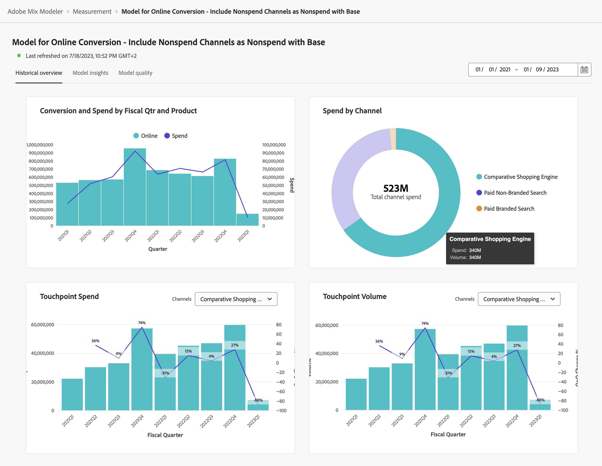

# Modellinsikter

Visa modellinsikter i  **[!UICONTROL Models]** gränssnitt i Mix Modeler:

1. Markera namnet på en modell med en **[!UICONTROL Last run status]** av ● **[!UICONTROL Success]** från **[!UICONTROL Models]** tabell.

1. Välj **[!UICONTROL Model Insights]**.

Du ser när den angivna modellen senast har uppdaterats och widgetar visas på tre flikar: Historisk översikt, Modellinsikter och Modellkvalitet.

Du kan ändra den datumperiod som widgetarna på varje flik baseras på. Ange en datumperiod eller välj  för att välja en datumperiod.

## Historisk översikt

På fliken Historik visas widgetar för:

* Konvertering och utgifter per kv och produkt

* Utgift per kanal

* Utgift för kontaktpunkt

  Du kan välja en alternativ utgiftsbaserad kanal att visa för den här widgeten. Välj en kanal från **[!UICONTROL Channels]**.

* Pekpunktsvolym

  Du kan välja en alternativ volymbaserad kanal att visa för den här widgeten. Välj en kanal från **[!UICONTROL Channels]**.

## Modellinsikter

På fliken Modellinsikter visas widgetar för:

* Bidrag per datum och basmedia

* Bidrag per kanal

* Sammanfattning av marknadsföringsprestanda

Du kan hovra över enskilda diagramelement i varje widget för att se en pover med mer information.

## Modellkvalitet

På fliken Modellkvalitet visas widgetar för mätning:

* R2 (R-fyrkantig), som anger hur väl data passar in i regressionsmodellen (godheten i passform).

* MAPE (medelvärde för absolut procentfel), som är en av de mest använda KPI:erna för att mäta prognosens exakthet och uttrycker prognosfelet som en procentandel av det faktiska värdet.

* RMSE (Rot Mean Square Error): som visar det genomsnittliga felet, viktat enligt kvadraten på felet.

