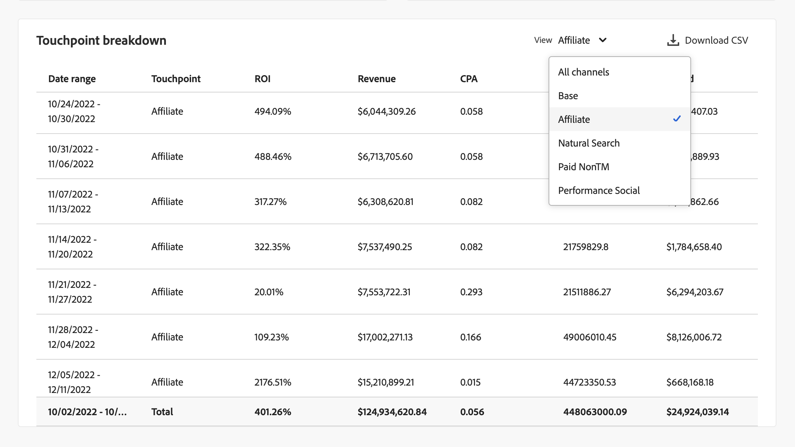
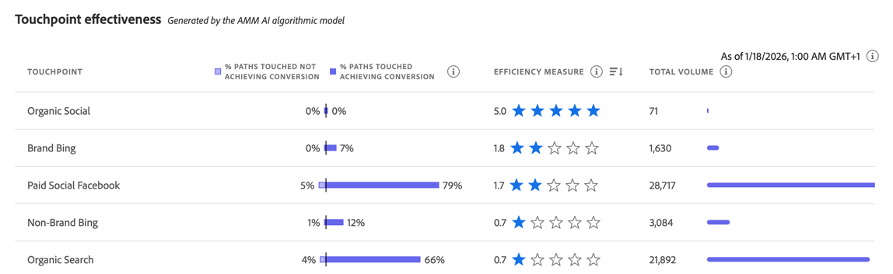

# Modellinsikter

Varje visualisering i modellinsikter har utformats för att hjälpa er att:

* Visualisera och kvantifiera effekten av organisationens marknadsföringsaktiviteter.
* Identifiera vilka kanaler som är högpresterande.
* Identifiera vilka kanaler som kan behöva optimeras.

Dessa insikter hjälper er sedan att ge stöd åt resursprioritering och resurstilldelning.

Så här visar du modellinsikter i gränssnittet  **[!UICONTROL Models]** i Mix Modeler:

1. I tabellen **[!UICONTROL Models]** markerar du namnet på en modell som har **[!UICONTROL Last run status]** av  **[!UICONTROL Success]**.

1. Välj **[!UICONTROL Model Insights]** på snabbmenyn.

Följande flikar är tillgängliga:

* [Modellinsikter](#model-insights)
* [Kanalsynergi](#channel-synergy)
* [Faktorer](#factors-beta) [!BADGE beta]
* [Attribution](#attribution) (endast för MTA-aktiverade modeller)
* [Diagnostik](#diagnostics)
* [Historisk översikt](#historical-overview).

Du kan ändra den datumperiod som visualiseringarna på varje flik baseras på. Ange en datumperiod eller välj  för att välja en datumperiod.

## Modelldrift

{{release-limited-testing-section}}

Om modellavvikelse upptäcks på modellen visas en **[!UICONTROL Model drift detected]**-dialogruta med alternativ som ska påminnas senare eller omedelbart [**[!UICONTROL Retrain]**](overview.md#retrain) modellen. Om du väljer **[!UICONTROL Remind me later]** påminns du nästa dag eller vid nästa inloggning.

## [!UICONTROL Model insights]

På fliken Modellinsikter visas visualiseringar för [Bidrag per datum och basmedia](#contribution-by-date-and-base-media), [Bidrag per kanal](#contribution-by-channel), [Sammanfattning av marknadsföringsprestanda](#marketing-performance-summary) och [Marginalkurvor](#marginal-response-curves). Fliken innehåller även en [tabell för sammanställning av kontaktpunkter](#touchppint-breakdown).

* Du kan hovra över enskilda diagramelement i varje visualisering för att visa en pover med mer information.

* Om du vill hämta en CSV-fil som innehåller data för visualiseringen väljer du .

* Om du vill hämta fullständiga modellinsiderdata i Microsoft® Excel-format väljer du  **[!UICONTROL Download data]**.

### Bidrag per datum och basmedia

Den här staplade diagramvisualiseringen ordnas enligt följande:

* Basen visas längst ned.
* Kanaler som inte används visas i mitten.
* Utgiftskanaler visas överst.

Den här visualiseringen representerar den andel bidrag som uppnås genom bas, via utgiftskanaler och icke-utgiftskanaler i ett datumintervall. Den här visualiseringen är användbar för att visa hur stor ökningen är. Basen representerar det som skulle ha hänt utan någon marknadsföring alls, och de icke-utgiftsrelaterade kanalerna plus utgiftskanalerna (utöver basen) tillskriver marknadsföringens påverkan. Kort och gott är att icke-spendera plus-utgifter motsvarar den inkrementella effekten av era marknadsföringssatsningar och visualiseringen ger enkel insikt i det värde som marknadsföring genererar.

### Bidrag per kanal

En donutvisualisering som visar hur bidraget distribueras av olika kanaler. Den här visualiseringen visar inkrementalitet genom objektivet på de tre främsta kanalerna (utom bas- och *alla andra* -kategorier). Visualiseringen underlättar prioriteringen och budgettilldelningen.

### Sammanfattning av marknadsföringsprestanda {#marketing-performance-summary}

>[!CONTEXTUALHELP]
>id="models_insights_undefinedchannels"
>title="Odefinierade kanaler"
>abstract="Odefinierade kanaler ingår, men har inga tilldelningar."

En vågrät stolpgrafivisualisering som visar ROI- eller CPA-prestanda för var och en av kanalerna. Den här visualiseringen visar på lönsamheten/CPA för era marknadsföringsinvesteringar. Kanalerna rangordnas i fallande ordning baserat på ROI/CPA. Visualiseringen hjälper till att identifiera vilka kanaler som är mest effektiva och vilka som kan behöva optimeras.

Odefinierade kanaler ingår i visualiseringen, men har inga konverteringar.

### Marginalkurvor

Linjediagrammet visar och jämför de marginella vinster som genereras av investeringen i era marknadsföringskanaler.  Identifierar den aktuella utgiften och den marginella brytpunkten (där den inkrementella avkastningen är mindre än de inkrementella utgifterna). Den här visualiseringen hjälper er därför att förstå när era marknadsföringsinvesteringar börjar bli mindre effektiva.

Kurvan, den aktuella utgiftspunkten, den marginella brytpunkten och motsvarande värden beräknas baserat på det valda dataområdet och den kanal du har valt.

Så här ändrar du kanal:

* Välj en kanal i listrutan **[!UICONTROL Channel]** om du vill uppdatera visualiseringen för en viss kanal.

### Uppdelning efter kontaktpunkter

Tabellen över indelning av kontaktytor visar veckovisa brytpunkter för alla eller valda kanaler, varje vecka, med nyckeltal som är kopplade till varje kanal. Tabellen gör det enklare att jämföra, identifiera trender och spåra prestanda på en mer detaljerad kanalnivå. Den här tabellen kompletterar visualiseringen [Bidrag per datum och basmedia](#contribution-by-date-and-base-media) och visualiseringen [Bidrag per kanal](#contribution-by-channel).

Följande kolumner är tillgängliga:

| Kolumn | Beskrivning |
|---|---|
| **[!UICONTROL Date range]** | Veckan att rapportera om. |
| **[!UICONTROL Touchpoint]** | Den specifika kontaktytskanalen. |
| **[!UICONTROL ROI]** | Procentandelen (**[!UICONTROL Revenue]** - **[!UICONTROL Spend]**) / **[!UICONTROL Spend]**. |
| **[!UICONTROL Revenue]** | Intäkterna för datumintervallet. |
| **[!UICONTROL CPA]** | **[!UICONTROL Spend]** / **[!UICONTROL Conversions]**. |
| **[!UICONTROL Conversions]** | Konverteringarna för datumintervallet. |
| **[!UICONTROL Spend]** | Utgifterna för dataområdet. |

Om du vill välja en viss kanal eller alla kanaler väljer du den i listrutan **[!UICONTROL View]**.

Välj  **[!UICONTROL Download CSV]** om du vill hämta innehållet i Touchpoint-tabellen.

## Kanalsynergi

På fliken **[!UICONTROL Channel synergy]** hjälper visualiseringen av **[!UICONTROL Channel synergies]** dig att identifiera hur marknadsföringskanaler interagerar för att skapa multimediala effekter, utöver deras individuella bidrag.

Heatmap-matrisen ger en visuell representation av synergisvärdena mellan par av utgiftskanaler. Den här matrisen hjälper marknadsförare att förstå hur kanaler interagerar för att öka prestandan. För varje modell normaliseras synergisvärdena från 0 till 10. Dessa värden kvantifierar *nästa dollarsynergi*, som beräknar hur effektivt två kanaler fungerar tillsammans när var och en får ytterligare en dollar av utgifterna på de aktuella nivåerna.

Detta nästa dollarsystem ger ett realistiskt mått på relativ synergistyrka, eftersom ramverket står för faktiska utgiftsförhållanden i utbildningsdata och därmed möjliggör mer välgrundade optimeringsbeslut.

Om du vill hämta en CSV-fil som representerar matrisen väljer du  **[!UICONTROL Download]**.

>[!NOTE]
>
>Om fliken **[!UICONTROL Channel synergy]** inte är synlig för en befintlig modell måste du träna om modellen för att aktivera funktioner och visualisering.

## **[!UICONTROL Factors]** [!BADGE beta] {#factors}

>[!CONTEXTUALHELP]
>id="models_factors_factorcontributionbreakdown"
>title="Uppdelning av faktorbidrag"
>abstract="Uppdelningen av faktorbidrag visar andelen baskonverteringar som kan tillskrivas de olika faktorer som ingår i modellen.  Ren bas representerar de underliggande konverteringarna som inträffar oberoende av marknadsföringens kontaktytor och faktorer som ingår i modellen. Det omfattar konverteringar som styrs av varumärken, upprepade köp, ekologisk efterfrågan och långsiktiga marknadstrender och säsongsvariation."

Fliken Faktorer [!BADGE beta] visar externa faktorrelaterade insikter.

Den här visualiseringen hjälper dig att förstå den inkrementella effekt som olika interna och externa faktorer har på konverteringens baslinje. Exempel: ekonomiska villkor eller marknadsföringsaktiviteter.

Använd listrutan **[!UICONTROL Factors]** för att välja vilka faktorer du vill visa.

<!-- need to update the image when we do have a proper example -->

Om du vill hämta en CSV-fil som innehåller data för tabellen väljer du .

Om inga data är tillgängliga visas meddelandet  **[!UICONTROL No data is available, you may need to retrain your model, or change the date range to view insights]**.

## [!UICONTROL Attribution] {#attribution}

>[!CONTEXTUALHELP]
>id="models_attribution_breakdownbychannel"
>title="Uppdelning efter kanal"
>abstract="**[!UICONTROL Breakdown by channel]** är en uppdelning efter kanaltyp för definierade kontaktytor, baserat på kundupplevelsehändelsens schema. Välj  och **[!UICONTROL Breakdown by touchpoint]** om du vill visa en uppdelning efter kontaktyta."

>[!CONTEXTUALHELP]
>id="models_attribution_breakdownbytouchpointposition"
>title="Uppdelning efter kontaktytsposition"
>abstract="Den här visualiseringen visar en uppdelning av konverteringar utifrån kontaktytans och kontaktytpunktens position över alla konverteringsbanor. Visualiseringen jämför om en kontaktyta ger bättre position än återstående positioner och andra kontaktytor på en position. Observera att summan av procentandelen för en attribueringsmodell för alla kontaktytor och positioner är lika med 100. Positionerna nybörjare, påverkare och finisher definieras enligt följande:<ul><li>**Starter**: Anger om kontaktytan är den första beröringen i en konverteringsbana.</li><li>**Spelare**: Anger om kontaktytan varken är den första eller sista beröringen som leder till konvertering.</li><li>**Closer**: Anger om kontaktytan är den sista kontakten före konvertering.</li></ul>"

>[!NOTE]
>
>Fliken Attribution är bara tillgänglig för MTA-aktiverade modeller.

På fliken [!UICONTROL Attribution] kan du förstå effekten av kontaktytor och marknadsföringskampanjer som har data på händelsenivå.  Se [Skapa modell](build.md).

Följande attribueringsmodeller stöds:

* Baserat på den valda modellen i Mix Modeler:
   * Algoritmisk - påverkad
   * Algoritmisk - inkrementell
* Regelbaserad:
   * Minskningsenheter
   * Första beröringen
   * Senaste beröring
   * Linjär
   * Ushape

Se [Multi-touch-attribuering](../get-started/about.md#multi-touch-attribution) för en introduktion om multitouch-attribueringsfunktionen i Mix Modeler.

Välj en eller flera attribueringsmodeller i listrutan **[!UICONTROL Attribution Model]**. De valda attribueringsmodellerna gäller för alla visualiseringar på fliken Attribution.

Mix Modeler Multi-Touch-attribuering i korthet anpassar sig efter Mix Modeler övergripande poäng och ROI. Dessa bakgrundsmusik är också tillgängliga som datauppsättningar i Experience Platform.

Fliken Attribution består av följande visualiseringar:

### [!UICONTROL Overview]

Visualiseringen av [!UICONTROL Overview] visar, för de valda attribueringsmodellerna, konverteringssummor och procentandelar. Om du väljer flera modeller läggs ytterligare cirklar till i visualiseringen, där var och en har en egen färg som motsvarar teckenförklaringen.

Om du vill visa ett popup-fönster med information om en attribueringsmodell håller du pekaren över någon av cirklarna i visualiseringen.

### [!UICONTROL Trends]

Visualiseringen [!UICONTROL Daily trends], [!UICONTROL Weekly trends] eller [!UICONTROL Monthly trends] visar konverteringstrender per dag, vecka eller månad för de valda attribueringsmodellerna.

Välj punkt genom att välja **[!UICONTROL Daily trends]**, **[!UICONTROL Weekly trends]** eller **[!UICONTROL Monthly trends]** från .

Om du vill se information för du markören över dataraden för en viss attribueringsmodell och visar en portfölj som visar det totala antalet konverteringar för dessa data.

### [!UICONTROL Breakdown]

Visualiseringen [!UICONTROL Breakdown] är en uppdelning efter kanal eller kontaktyta av konverteringarna för var och en av de valda attribueringsmodellerna. Den här visualiseringen kan vara till hjälp när du ska fatta beslut om effektiviteten för varje kanal eller kontaktyta.

Om du vill välja nedbrytningstyp väljer du **[!UICONTROL Breakdown by channel]** eller **[!UICONTROL Breakdown by touchpoint]** från .

Håll markören över något av diagramelementen om du vill se detaljer.

### [!UICONTROL Top campaigns]

I visualiseringen av de populäraste kampanjerna visas en tabell med de främsta kampanjerna med kolumner för Campaign-namn, Channel-typ, Media-typ och inkrementella konverteringar. Den här visualiseringen kan hjälpa ert team att informera om effektiviteten hos en viss kampanj för en viss kanal och ge er insikter om vilka kampanjer ni bör investera i ytterligare.

Om du vill sortera tabellen i stigande eller fallande ordning ↓ för Kanal, Medietyp eller Inkrementella konverteringar markerar du kolumnrubriken och växlar sorteringen.

Om du vill expandera tabellen i en separat dialogruta väljer du **[!UICONTROL Expand]** från .

I den utökade dialogrutan för de bästa kampanjerna visas samma tabell med extra kolumner för

* Inkrementella konverteringar
* Påverkade konverteringar
* Första beröringskonverteringen
* Senaste pekkonverteringar

  Du kan markera de extra kolumnrubrikerna om du vill sortera tabellen i stigande eller fallande ordning.

Välj **[!UICONTROL Close]** om du vill stänga den utökade dialogrutan för de bästa kampanjerna.

### [!UICONTROL Breakdown by touchpoint position]

Visualiseringen av [!UICONTROL Breakdown by touchpoint position] är en uppdelning av konverteringar av attribut efter position för kontaktytan och kontaktytan över alla konverteringssökvägar. I det här diagrammet kan du jämföra om en kontaktyta bidrar bättre på en position än återstående positioner och andra kontaktytor på en position.

>[!NOTE]
>
>Summan av procentandelen för en attribueringsmodell för alla kontaktytor och positioner ska vara lika med 100.

Positionerna [!UICONTROL Starter], [!UICONTROL Player] och [!UICONTROL Closer] definieras enligt följande:

| Position | Beskrivning |
|---|---|
| [!UICONTROL Starter] | Den här positionen anger om kontaktytan är den första beröringen i en konverteringsbana. |
| [!UICONTROL Player] | Den här positionen anger om kontaktytan inte är den första eller sista beröringsraden som leder till konvertering. |
| [!UICONTROL Closer] | Den här positionen anger om kontaktytan är den sista kontakten före konvertering. |

### [!UICONTROL Top conversion paths]

Visualiseringen [!UICONTROL Top conversion paths] visar de fem populäraste konverteringssökvägarna baserat på de valda attribueringsmodellerna.

För varje konverteringsbana ser du:

* antalet kanaler som påverkas,
* de totala tilldelade banorna,
* procentandelen av de tilldelade banorna för denna konverteringsbana jämfört med de totala tilldelade banorna,
* för varje kanal, bidragsprocenten för attribueringsmodellen, och
* summan av dessa procentsatser för kanalattribueringsmodellen.

## [!UICONTROL Diagnostics] {#diagnostics}

>[!CONTEXTUALHELP]
>id="models_diagnostics_modelassessment"
>title="Modellbedömningsdiagram"
>abstract="Modellbedömningsvisualiseringar bryts ned på faktiska kontra förväntade eller kvarvarande konverteringar."
>additional-url="https://experienceleague.adobe.com/en/docs/mix-modeler/using/overview" text="Mix Modeler - översikt"
>additional-url="https://video.tv.adobe.com/v/3440794/?learn=on&enablevpops" text="Mix Modeler demo"

>[!CONTEXTUALHELP]
>id="models_diagnostics_modeltrainingfitmetrics"
>title="Mätvärden för modellpassning"
>abstract="Visar en översikt över flera modeller av passningsvärden för utbildning."

>[!CONTEXTUALHELP]
>id="models_diagnostics_pathstouched"
>title="Bana rörda"
>abstract="Perfekta banor är den procentandel av banorna som uppnår konvertering och den procentandel av banorna som inte uppnår konvertering för varje kontaktyta."

>[!CONTEXTUALHELP]
>id="models_diagnostics_efficiencymeasure"
>title="Effektivitetsmått"
>abstract="Det effektivitetsmått som genereras av den algoritmiska attribueringsmodellen anger den relativa vikten av en kontaktyta för konvertering oberoende av kontaktytans volym. Detta mäts på en skala från 1 till 5. Observera att högre kontaktytpunkter inte garanterar högre effektivitetsmått."

>[!CONTEXTUALHELP]
>id="models_diagnostics_totalvolume"
>title="Total volym"
>abstract="Den totala volymen är det sammanlagda antalet gånger som en kontaktyta berördes av en användare, inklusive kontaktytor som visas på en bana och som uppnår konvertering, samt banor som inte leder till konvertering."

>[!CONTEXTUALHELP]
>id="models_diagnostics_modeldateinfo"
>title="Modelldatum den"
>abstract="Data för det här registret genereras endast för specifika tidsperioder.  Datumet **[!UICONTROL As of]** anger när data genererades och baseras på data från startDate till endDate."

Fliken **[!UICONTROL Diagnostics]** visar visualiseringar för:

* **[!UICONTROL Model Assessment]** visualiseringar som består av:

  

   * Ett diagram som du kan dela upp på faktiska kontra förväntade eller kvarvarande konverteringar.
Om du vill dela upp visualiseringen väljer du något av följande alternativ i listan **[!UICONTROL Breakdown]**.

      * **[!UICONTROL Actual vs Predicted]**: Det här alternativet jämför verkliga värden med modellprognoser. I idealfallet bör de förväntade värdena vara nära anpassade till de faktiska värdena, även om en viss avvikelse förväntas. Stora eller systematiska avvikelser eller mönster kan tyda på saknade relationer och data eller potentiella avvikelser.

      * **[!UICONTROL Residuals]**: Det här alternativet visar skillnaden mellan faktiska och förväntade värden. En modell med bra prestanda har residualer som är slumpmässigt fördelade, utan tydliga mönster eller ökat spridning. Strukturerade trender eller vidgade residualer kan signalera saknade relationer och data- eller variansproblem.

   * En tabell som visar följande kolumner för varje konverteringsmått:

      * **[!UICONTROL Actual Conversion]**
      * **[!UICONTROL Predicted Conversion]**
      * **[!UICONTROL Residual Conversion]**
      * **[!UICONTROL R2]**, en poäng som anger hur bra data passar in i regressionsmodellen (hur bra det är att anpassa).
      * **[!UICONTROL MAPE]** (medelvärde för absolut procentfel), som är en av de mest använda KPI:erna för att mäta prognosexakthet och uttrycker prognosfelet som en procentandel av det faktiska värdet.
      * **[!UICONTROL RMSE]** (Ruta med rotmedelfel): som visar det genomsnittliga felet, viktat enligt kvadraten på felet.

  Om du vill hämta en CSV-fil som innehåller data för tabellen väljer du .

* **[!UICONTROL Model training fit metrics]**-tabell som visas för varje konverteringsmått:

  

   * **[!UICONTROL Training R2]**: Anger andelen varians i de faktiska värdena som förklaras av modellens prognoser, från 0 till 1.
   * **[!UICONTROL Training sMAPE]** (symmetriskt medelvärde för absolut procentfel): Mäter medelprocentfel för utbildningsdata. Lägre värden ger bättre precision.
   * **[!UICONTROL Training RMSE]** (Rot Mean-kvadrat-fel): Mäter genomsnittligt procentfel för utbildningsdata. Utjämnar större fel mer än MAPE. Lägre RMSE ger bättre prediktiv precision men är känsligt för avvikelser.
   * **[!UICONTROL Out-of-sample sMAPE]**: Utvärderar procentfel för osynliga data, balanserar över- och underprognoser. Hjälper till att utvärdera generalisering. För närvarande utvärderar Mix Modeler ett procentfel med hjälp av sista kvartalet av utbildningsdata som en utelämningsuppsättning.
   * **[!UICONTROL Out-of-sample RMSE]**: Utvärderar procentfel för osynliga data, balanserar över- och underprognoser. Hjälper till att utvärdera generalisering. För närvarande utvärderar Mix Modeler ett procentfel med hjälp av sista kvartalet av utbildningsdata som en utelämningsuppsättning. RMSE penaliserar större fel mer än MAPE.

* **[!UICONTROL Touchpoint effectiveness]**-tabellen, som representerar resultatet av AI-algoritmisk modell för attribuering.

  

  Data för det här registret genereras endast för specifika tidsperioder. Välj **[!UICONTROL As of *xx/xx/xx, xx:xx TZ *]** om du vill ha mer information.

  Visualiseringen visar, i fallande ordning [!UICONTROL Efficiency measure] , för varje kontaktyta:

   * **[!UICONTROL Paths touched]**: visualiserar procentandelen sökvägar som uppnår konvertering och procentandelen sökvägar som inte uppnår konvertering. För en kontaktyta ser du fler konverteringar när attribueringskonverteringsgraden är hög. Proportionerna jämför procentandelen sökvägar som leder till konvertering med procentandelen sökvägar som *inte* leder till konvertering.
   * **[!UICONTROL Efficiency measure]**: genereras av den algoritmiska attribueringsmodellen och effektivitetsmåttet anger den relativa vikten av en kontaktyta mot konverteringen, oberoende av kontaktytpunktsvolym. Effektiviteten mäts på en skala från 1 till 5. Observera att högre kontaktytpunkter inte garanterar högre effektivitetsmått.
   * **[!UICONTROL Total volume]**: Det sammanlagda antalet gånger en användare vidrör en kontaktyta. Antalet är inklusive kontaktytor som visas på en bana som uppnår konvertering samt banor *som inte* resulterar i konvertering.

### Modellkörningsidentifiering

>[!AVAILABILITY]
>
>Funktionerna som beskrivs i det här avsnittet är i den begränsade testfasen av releasen och är kanske inte tillgängliga än i din miljö. Den här anteckningen tas bort när funktionen är allmänt tillgänglig. Mer information om Mix Modeler finns i [Mix Modeler funktionsreleaser](/help/releases/latest.md).
>

Om modellavvikelse upptäcks visas ett **[!UICONTROL Model drift detected]**-meddelande högst upp.

Välj **[!UICONTROL Hide]** om du vill dölja meddelandet. Meddelandet visas igen nästa dag eller vid nästa inloggning.

## [!UICONTROL Historical overview]

Fliken Historisk översikt visar visualiseringar för:

### Konvertering och utgifter per kv och produkt

Den här visualiseringen representerar konvertering och utgiftsfördelning för olika kvartal inom det angivna datumintervallet. Visualiseringen hjälper till att identifiera högpresterande kvarter där utgifter driver konverteringar.

### Utgift per kanal

Den här visualiseringen representerar utgiftsfördelningen i olika kanaler inom det angivna datumintervallet. Visualiseringen gör det enkelt att snabbt identifiera vilka kanaler som får mest pengar.

### Utgift för kontaktpunkt

Den här visualiseringen representerar utgiftsfördelningen över betalda kontaktytor för varje kvartal inom det angivna datumintervallet. Visualiseringen gör det möjligt att förstå vilka kontaktytor som prioriteras inom specifika kanaler och kvartal. Visualiseringen hjälper till att identifiera mönster och trender för kanalanvändning, särskilt kanaler med låga och sällan använda resurser över tid.

Så här kan du välja en alternativ utgiftsbaserad kanal att visa för den här visualiseringen:

* Välj en kanal från **[!UICONTROL Channels]**.

### Pekpunktsvolym

Den här visualiseringen representerar volymfördelningen över alla kontaktytor för varje kvartal inom det angivna datumintervallet.

Så här kan du välja en alternativ volymbaserad kanal som ska visas för visualiseringen:

* Välj en kanal från **[!UICONTROL Channels]**.

## **[!UICONTROL Edit]**

Du kan redigera namn, beskrivning och schemaläggning av utbildning och poängsättning för modellen.

1. Välj  Redigera

1. I dialogrutan **[!UICONTROL Edit model]**:

   * Ange en ny **[!UICONTROL Name]** och **[!UICONTROL Description]**.

   * Aktivera **[!UICONTROL Status]** om du vill aktivera schemaläggning. Du kan bara aktivera schemaläggning för modeller som är tränade och poängsatta.

      1. Välj en **[!UICONTROL Scoring frequency]**:

         * **[!UICONTROL Daily]**: Ange en giltig tid (till exempel `05:22 pm`) eller använd .
         * **[!UICONTROL Weekly]**: Välj en veckodag och ange en giltig tid (till exempel `05:22 pm`) eller använd .
         * **[!UICONTROL Monthly]**: Välj en dag i månaden i listrutan Kör på varje och ange en giltig tid (till exempel `05:22 pm`) eller använd .

      1. Välj en **[!UICONTROL Training frequency]** i listrutan: **[!UICONTROL Monthly]**, **[!UICONTROL Quarterly]**, **[!UICONTROL Yearly]** eller **[!UICONTROL None]**.

     

1. Välj **[!UICONTROL Save]**.
