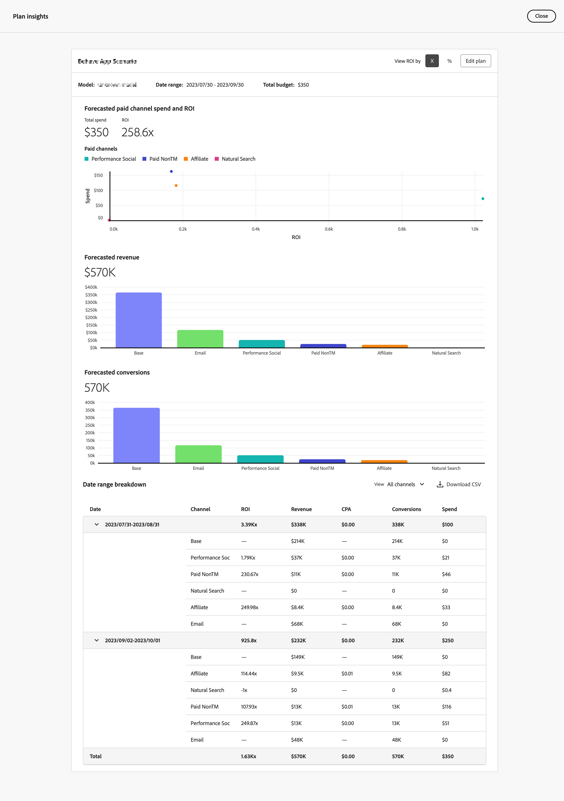

# Redigera en plan

Redigera en plan i  **[!UICONTROL Plans]** i Mix Modeler väljer du din plan efter namn.

I [!UICONTROL Plan insights], dina planinsikter skapas och visar [!UICONTROL Model], [!UICONTROL Data range]och [!UICONTROL Total budget] som planen baseras på.

När hämtningen är klar visas en översikt över din plan, som består av:

- [!UICONTROL Forecasted paid channel ROI] visualisering
- [!UICONTROL Forecasted revenue] visualisering
- [!UICONTROL Data range breakdown] plantabell, visa kolumner för

   - Kanal
   - avkastning
   - CPA
   - Intäkter
   - Konverteringsmål
   - Utgift

1. Välj **[!UICONTROL Close]** för att återgå till gränssnittet Planer.

1. Om du vill hämta en CSV-fil som innehåller data för datumintervallet väljer du  **[!UICONTROL Download CSV]**.

1. Om du vill redigera planen väljer du **[!UICONTROL Edit plan]**:

   1. I **[!UICONTROL Spend selection]** för varje datumintervall i budgeten använder du  för att öppna kanaldistributionsvyn för det dataintervallet.

   1. Om du vill ändra budgeten för varje kanal ändrar du värdena för **[!UICONTROL Min]** och **[!UICONTROL Max]** eller använda skjutreglagen.

   1. Om du vill växla mellan valuta- eller procentindata väljer du **[!UICONTROL $]** eller **[!UICONTROL %]** for **[!UICONTROL View spend by]**.

      

   1. Om du vill redigera information om din plan väljer du **[!UICONTROL Edit details]**:

      1. I **[!UICONTROL Setup]** om tillämpligt, ändra **[!UICONTROL Plan name]** och **[!UICONTROL Description]**.

      1. I **[!UICONTROL Budget]** avsnitt:

         1. Ändra **[!UICONTROL Date range]** för ett eller flera av datumintervallen i din plan, antingen genom att ange datum eller genom att välja ett datumintervall med .

         1. Ändra **[!UICONTROL Budget]** ett eller flera av datumintervallen i din plan.

         Om du vill lägga till ytterligare datumintervall väljer du  **[!UICONTROL Add row]**.

         Om du vill ta bort ett datumintervall och en associerad budget väljer du .

         Så här definierar du en maximal budget:

         1. Byt **[!UICONTROL Maximize budget]** på.
         1. Ange det maximala budgetbeloppet. Beloppet ska vara lika med eller högre än det totala budgetbeloppet som angetts för datumintervallen.

      1. Välj **[!UICONTROL Next]** för att gå tillbaka till **[!UICONTROL Spend]** -avsnitt. Välj **[!UICONTROL Cancel]** för att återgå till en översikt över dina planer.

         

1. När du är klar med redigeringen av din plan väljer du **[!UICONTROL Edit]**.

   I **[!UICONTROL All changes are final]** dialogruta, välja **[!UICONTROL OK]** för att uppdatera planens aktuella utgiftsallokering och prognoser för avkastning och intäkter. Välj **[!UICONTROL Cancel]** om du vill avbryta uppdateringen av din plan.

1. Om du vill avbryta dina planuppdateringar väljer du **[!UICONTROL Cancel]**.

   I **[!UICONTROL No work will be saved]** dialogruta, välja **[!UICONTROL Cancel]** för att fortsätta arbeta med din plan eller välja **[!UICONTROL OK]** för att återgå till gränssnittet Planer.
