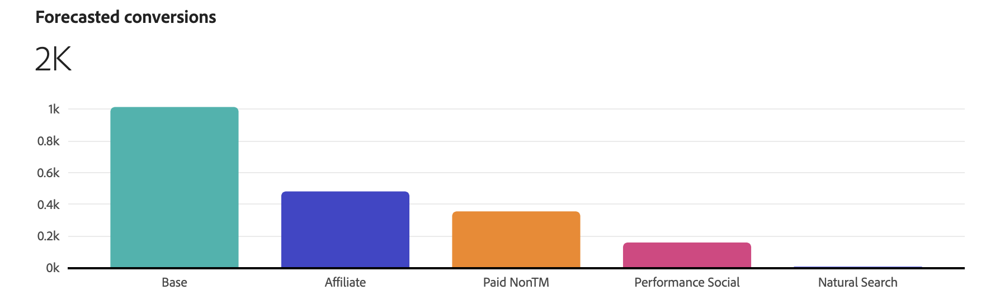

# Planera insikter

I [!UICONTROL Plan insights] skapas dina planinsikter och visar [!UICONTROL Model], [!UICONTROL Data range] och [!UICONTROL Total budget] som planen baseras på.

När hämtningen är klar visas en översikt över din plan, som består av:

- [!UICONTROL Forecasted paid channel ROI]-visualisering
- [!UICONTROL Forecasted revenue]-visualisering
- [!UICONTROL Forecasted conversion]-visualisering
- [!UICONTROL Marginal channel return]-visualisering
- tabellen [!UICONTROL Data range breakdown] i planen, med kolumner för

   - Kanal
   - avkastning
   - CPA
   - Intäkter
   - Konverteringsmål
   - Utgift

Om du vill stänga gränssnittet väljer du **[!UICONTROL Close]**.

Om du vill ändra hur du visar avkastningen på din plan väljer du **[!UICONTROL X]** eller **[!UICONTROL &#x200B; %]** **[!UICONTROL View ROI]**.

## Prognostiserade utgifter för betalda kanaler och avkastning på investerat kapital

Den här visualiseringen visar en utspridd yta för de förutsagda utgifterna och avkastningen på investeringar i dina betalda kanaler, baserat på modell, datumintervall och budget.

## Prognostiserade intäkter

I den här stapeldiagramvisningen visas de beräknade intäkterna för kanalerna baserat på modell, datumintervall och budget.

## Prognostiserade konverteringar

I den här stapeldiagramvisningen visas de prognostiserade konverteringarna för kanalerna baserat på modell, datumintervall och budget.

## Marginalkanalsretur

Den här linjediagramvisningen visar en marginell returkurva för den valda kanalen med indikatorer för **[!UICONTROL Marginal break-even]** och **[!UICONTROL Return point]**. Den här visualiseringen hjälper er att förstå hur en kanals utgifter sträcker sig från att nå en marginell nollpunkt och om ni har utrymme att öka utgifterna i en kanal eller borde spendera mindre på en kanal för att förbättra kanalens utläggseffektivitet.

Om du vill välja en viss kanal för visualiseringen väljer du en kanal i listrutan **[!UICONTROL View]**.

## Uppdelning av datumintervall

Tabellen [!UICONTROL Date range breakdown] visar detaljerade, detaljerade data per kanal för [!UICONTROL ROI], [!UICONTROL Revenue], [!UICONTROL CPA], [!UICONTROL Conversions] och [!UICONTROL Spend].

1. Välj  **[!UICONTROL Download CSV]** om du vill hämta en CSV-fil som innehåller data för datumintervallet. På snabbmenyn:

   - Välj  **[!UICONTROL Detailed CSV]** om du vill ha detaljerade data i CSV-format.
   - Välj  **[!UICONTROL Summary CSV]** om du vill visa sammanfattningsdata i CSV-format.

   Detaljerade data är data insamlade per vecka. Sammanfattningsdata är data som lagras i det modellgivna datumintervallet.

1. Välj **[!UICONTROL All channels]**, **[!UICONTROL Paid channels]** eller **[!UICONTROL Non-paid channels]** från markeringen **[!UICONTROL View]** om du vill visa datumintervallfördelningen per kanalkategori.

## Redigera plan

1. Om du vill redigera din plan väljer du  **[!UICONTROL Edit plan]**:

   I avsnittet **[!UICONTROL Spend selection]** använder du  för att öppna kanaldistributionsvyn för det dataintervallet för varje datumintervall.

   Ni kan använda historiska referensdata om ni vill använda tidigare marknadsföringsutgiftsdata och insikter. Du bör överväga historiska referensdata för att:

   - Förbättra budgettilldelningen genom att markera högpresterande kanaler och dåligt fungerande kanaler.
   - stödja trendanalys.
   - Identifiera effektiva strategier och undvik misstag när du konfigurerar planer.

   Om du väljer en historisk referensperiod kan du anpassa dig till tidigare inställningar för utgiftsmönster och Mix Modeler planeringsfunktion generera planer som ligger inom dina förväntningar. Dessa planer bör i slutändan öka intressenternas förtroende, säkerställa att marknadsföringsplanerna är strategiska, effektiva och att dessa planer bygger på beprövade resultatdata och affärsbehov.

   

   1. Välj **[!UICONTROL Spend pattern]**.

      - Som standard är detta **[!UICONTROL Automatic]**.
      - Välj **[!UICONTROL Historical reference]** och ange en **[!UICONTROL Start date]** för att referera till tidigare marknadsföringsutgiftsdata som redan är tillgängliga för Mix Modeler. **[!UICONTROL End date]** bestäms automatiskt utifrån det valda dataområdet. Det föreslagna startdatumet är den första tillgängliga informationen om tidigare marknadsföringsutgifter som finns tillgänglig. Om du vill ange att du har valt en historik som inte finns visas en .

   1. Om du vill ändra budgeten för varje kanal ändrar du värdena för **[!UICONTROL Min]** och **[!UICONTROL Max]** eller använder reglagen.

   1. Om du vill växla mellan valuta- eller procentindata väljer du **[!UICONTROL $]** eller **[!UICONTROL %]** för **[!UICONTROL View spend by]**.

   1. Om du vill redigera information om din plan väljer du **[!UICONTROL Edit details]**:

      1. I avsnittet **[!UICONTROL Setup]** ändrar du **[!UICONTROL Plan name]** och **[!UICONTROL Description]**, om tillämpligt.

      1. I avsnittet **[!UICONTROL Budget]**:

         1. Ändra **[!UICONTROL Date range]** för ett eller flera av din plans datumintervall, antingen genom att ange datum eller välja ett datumintervall med .

         1. Ändra **[!UICONTROL Budget]** för ett eller flera av din plans datumintervall.

         Om du vill lägga till ytterligare datumintervall, var och en med sin budget, väljer du  **[!UICONTROL Add row]**.

         Om du vill ta bort ett datumintervall och en associerad budget väljer du .

         Så här definierar du en maximal budget:

         1. Aktivera **[!UICONTROL Maximize budget]**.
         1. Ange det maximala budgetbeloppet. Beloppet ska vara lika med eller högre än det totala budgetbeloppet som angetts för datumintervallen.

      1. Välj **[!UICONTROL Next]** om du vill återgå till avsnittet **[!UICONTROL Spend]**. Välj **[!UICONTROL Cancel]** om du vill återgå till din planöversikt.

         

   1. Om du har definierat avancerade konfigurationer för din plan väljer du **[!UICONTROL Next]**.

      

      - Ditt plannamn, din modell, datumintervall och din totala budget sammanfattas.

      - Som standard beräknar Mix Modeler automatiskt den genomsnittliga intäkten per konvertering med hjälp av de senaste historiska säsongsuppgifterna. I **[!UICONTROL Average Revenue per conversion]** kan du definiera en specifik genomsnittlig intäkt per konvertering.

         1. För varje datumintervall i din budget:
            1. Välj ett datumintervall i listrutan **[!UICONTROL Date range]**.
            1. Ange ett **[!UICONTROL Average revenue]**-värde.

         1. Välj  Lägg till en anpassad genomsnittlig intäkt per konverteringsenhet för att lägga till ett datumintervall.
         1. Välj  om du vill ta bort ett datumintervall.

        >[!NOTE]
        >
        >Om modellen inte innehåller historiska intäktsdata måste du definiera en genomsnittlig intäkt per konvertering för varje datumintervall som du anger för din budget.
        >

      - Som standard beräknar Mix Modeler automatiskt kanalkostnaderna med hjälp av de senaste säsongsuppgifterna. I **[!UICONTROL Channel costs]** kan du definiera anpassade kanalkostnader.

         1. Definiera anpassade kanalkostnader för varje kanal i modellen.
            1. Välj en kanal i listrutan **[!UICONTROL Channel]**.
            1. För varje datumintervall i din budget:
               1. Välj ett datumintervall i listrutan **[!UICONTROL Date range]**.
               1. Ange ett **[!UICONTROL Average revenue]**-värde.
            1. Välj  **[!UICONTROL Add custom average revenue per conversion unit]** om du vill lägga till ett datumintervall.
            1. Välj  om du vill ta bort ett datumintervall.

         1. Välj  **[!UICONTROL Add custom channel cost]** om du vill lägga till en kanal.
         1. Välj  om du vill ta bort en anpassad kanal.

1. När du är klar med redigeringen av din plan väljer du **[!UICONTROL Edit]**.

   I dialogrutan **[!UICONTROL All changes are final]** väljer du **[!UICONTROL OK]** för att uppdatera planens aktuella utgiftsallokering och prognoser för avkastning och intäkter. Välj **[!UICONTROL Cancel]** om du vill avbryta uppdateringen av din plan.

1. Om du vill avbryta dina avtalsuppdateringar väljer du **[!UICONTROL Cancel]**.

   I dialogrutan **[!UICONTROL No work will be saved]** väljer du **[!UICONTROL Cancel]** för att fortsätta arbeta med din plan eller **[!UICONTROL OK]** för att återgå till gränssnittet för planer.
